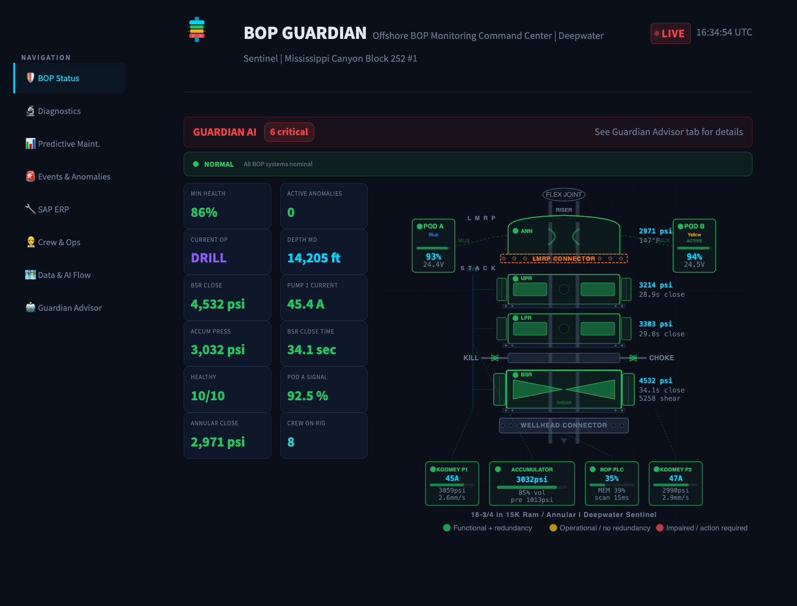
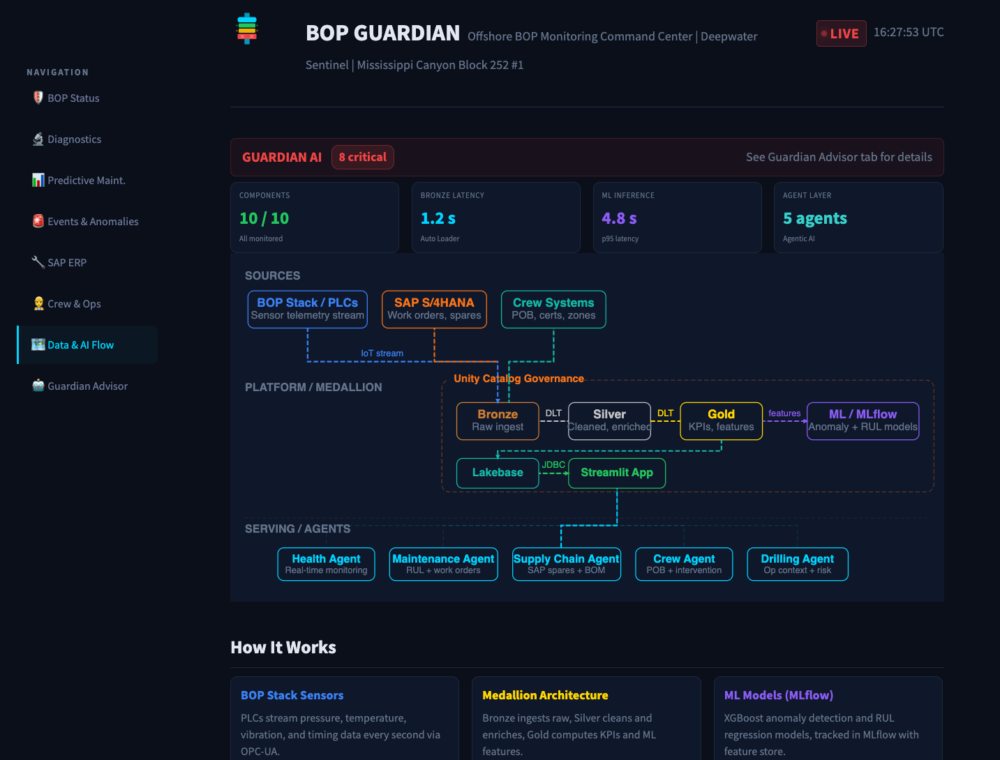
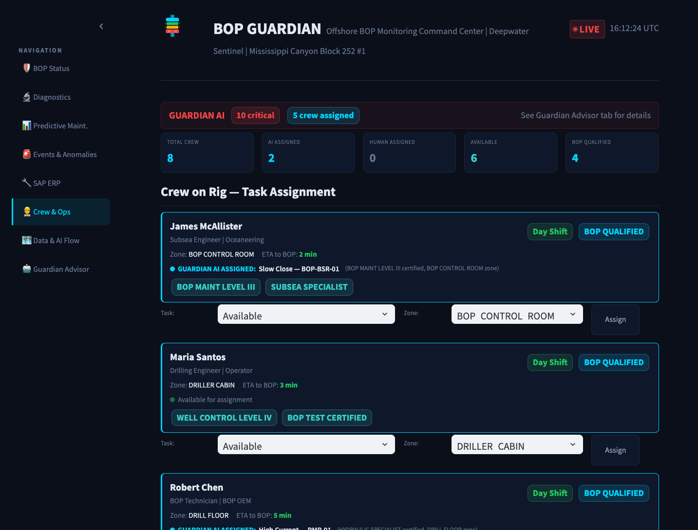

[](https://databricks.com)
[](https://docs.databricks.com/en/data-governance/unity-catalog/index.html)
[](https://docs.databricks.com/en/compute/serverless.html)

# BOP Guardian — Offshore BOP Monitoring Command Center

A real-time digital twin and agentic AI command center for monitoring offshore Blowout Preventer (BOP) stacks. Built as a [Databricks App](https://docs.databricks.com/en/dev-tools/databricks-apps/index.html) using Streamlit, this solution demonstrates how Databricks can power safety-critical industrial monitoring in upstream oil & gas operations.



## Overview

Offshore drilling operations depend on the BOP stack as the last line of defense against uncontrolled well events. BOP Guardian brings together real-time telemetry simulation, predictive maintenance, SAP ERP integration, crew management, and multi-agent AI into a single command center:

- **Digital Twin Visualization** — Live P&ID schematic of the BOP stack with traffic-light health indicators, pressure readings, and fill-level bars for all components (annular, pipe rams, blind shear ram, control pods, pumps, accumulator, PLC)
- **Agentic AI Engine** — Five rule-based sub-agents (Health, Maintenance, Supply Chain, Crew, Drilling) analyze every simulator tick and produce severity-ranked recommendations with automatic crew assignment
- **Predictive Maintenance** — Remaining Useful Life (RUL) predictions, failure probability forecasting, and failure pattern matching per component
- **SAP ERP Integration** — Work order tracking, spare parts inventory with min-stock alerts, and emergency ordering workflows
- **Crew & Ops Management** — Certification-aware crew assignment, intervention ETA calculation, human-in-the-loop task dispatching
- **Data & AI Flow** — Interactive architecture diagram showing the medallion pipeline from sensors through Bronze/Silver/Gold to serving agents



## Architecture

```
┌─────────────────────────────────────────────────────────────────┐
│  BOP Stack Sensors (simulated)                                  │
│  10 components × 3-5 tags each → telemetry stream               │
└──────────────────────────┬──────────────────────────────────────┘
                           │
                    ┌──────▼──────┐
                    │   Bronze    │  Raw telemetry, events, anomalies
                    ├─────────────┤
                    │   Silver    │  Cleaned readings, health scores
                    ├─────────────┤
                    │    Gold     │  KPIs, RUL predictions, work orders
                    └──────┬──────┘
                           │
              ┌────────────┼────────────┐
              │            │            │
        ┌─────▼────┐ ┌────▼─────┐ ┌───▼──────┐
        │ Guardian  │ │  Crew    │ │  Drilling │
        │ AI Agent  │ │  Agent   │ │  Agent    │
        └─────┬────┘ └────┬─────┘ └───┬──────┘
              │            │            │
              └────────────┼────────────┘
                           │
                    ┌──────▼──────┐
                    │  Streamlit  │  Databricks App
                    │  Dashboard  │  8-tab command center
                    └─────────────┘
```

**Components monitored:**
| Asset ID | Component | Key Sensors |
|----------|-----------|-------------|
| BOP-ANN-01 | 18-3/4" Annular Preventer | Close/open/regulated pressure, temperature |
| BOP-UPR-01 | Upper Pipe Ram 6-5/8" | Close/open pressure, close time |
| BOP-LPR-01 | Lower Pipe Ram 6-5/8" | Close/open pressure, close time |
| BOP-BSR-01 | Blind Shear Ram | Close/open/shear pressure, close time |
| POD-A / POD-B | Control Pods (Blue/Yellow) | Signal strength, voltage, temperature, comms |
| PMP-01 / PMP-02 | Koomey Pump Units | Pressure, flow, current, temperature, vibration |
| ACC-01 | Accumulator Bank | Pressure, precharge, volume, temperature |
| PLC-01 | BOP Control PLC | CPU load, memory, scan time, I/O errors |

## Dashboard Tabs

| Tab | Description |
|-----|-------------|
| **BOP Status** | Live digital twin with KPI tiles, P&ID schematic, traffic-light health |
| **Diagnostics** | Sensor trend charts, anomaly overlays, component deep-dives |
| **Predictive Maint.** | RUL predictions, failure probability, failure pattern library |
| **Events & Anomalies** | Real-time event log with severity filtering |
| **SAP ERP** | Work orders, spare parts inventory, maintenance KPIs |
| **Crew & Ops** | Crew roster, certification matrix, AI-driven task assignment |
| **Data & AI Flow** | Interactive architecture diagram with medallion pipeline |
| **Guardian Advisor** | Natural-language chat interface to the agentic AI engine |



## Getting Started

### Prerequisites

- A Databricks workspace with [Databricks Apps](https://docs.databricks.com/en/dev-tools/databricks-apps/index.html) enabled
- Databricks CLI installed and configured

### Deploy with Databricks Asset Bundles (recommended)

```bash
databricks bundle deploy -t dev
databricks bundle run -t dev
```

### Deploy manually

1. Clone this repository into your Databricks workspace:
   ```bash
   databricks workspace import-dir ./app /Workspace/Users/<your-email>/bop-guardian/app --overwrite
   databricks workspace import-file ./app.yaml /Workspace/Users/<your-email>/bop-guardian/app.yaml --overwrite
   ```

2. Create and deploy the app:
   ```bash
   databricks apps create bop-guardian --description "Offshore BOP Monitoring Command Center"
   databricks apps deploy bop-guardian --source-code-path /Workspace/Users/<your-email>/bop-guardian
   ```

3. Open the app URL printed by the deploy command.

## Simulated Event Cycle

The simulator runs a repeating 40-tick event cycle to demonstrate anomaly detection and agent response:

| Ticks | Event | Affected Component |
|-------|-------|--------------------|
| 0–9 | Normal operations | All green |
| 10–14 | Pressure leak developing | Annular Preventer |
| 15–19 | Intermittent comm loss | Control Pod A |
| 20–24 | High current draw (bearing wear) | Koomey Pump 1 |
| 25–29 | Slow close detected | Blind Shear Ram |
| 30–34 | Recovery / stabilization | Systems recovering |
| 35–39 | Pressure decay anomaly | Accumulator Bank |

## Project Support

Please note the code in this project is provided for your exploration only, and is not formally supported by Databricks with Service Level Agreements (SLAs). It is provided AS-IS and we do not make any guarantees of any kind. Please do not submit a support ticket relating to any issues arising from the use of this project.

Any issues discovered through the use of this project should be filed as GitHub Issues on this repository. They will be reviewed on a best-effort basis but no formal SLA or support is guaranteed.


## License

**Definitions.**

**Agreement:** The agreement between Databricks, Inc., and you governing the use of the Databricks Services, as that term is defined in the Master Cloud Services Agreement (MCSA) located at www.databricks.com/legal/mcsa.

**Licensed Materials:** The source code, object code, data, and/or other works to which this license applies.

**Scope of Use.** You may not use the Licensed Materials except in connection with your use of the Databricks Services pursuant to the Agreement. Your use of the Licensed Materials must comply at all times with any restrictions applicable to the Databricks Services, generally, and must be used in accordance with any applicable documentation. You may view, use, copy, modify, publish, and/or distribute the Licensed Materials solely for the purposes of using the Licensed Materials within or connecting to the Databricks Services. If you do not agree to these terms, you may not view, use, copy, modify, publish, and/or distribute the Licensed Materials.

**Redistribution.** You may redistribute and sublicense the Licensed Materials so long as all use is in compliance with these terms. In addition:

- You must give any other recipients a copy of this License;
- You must cause any modified files to carry prominent notices stating that you changed the files;
- You must retain, in any derivative works that you distribute, all copyright, patent, trademark, and attribution notices, excluding those notices that do not pertain to any part of the derivative works; and
- If a "NOTICE" text file is provided as part of its distribution, then any derivative works that you distribute must include a readable copy of the attribution notices contained within such NOTICE file, excluding those notices that do not pertain to any part of the derivative works.

You may add your own copyright statement to your modifications and may provide additional license terms and conditions for use, reproduction, or distribution of your modifications, or for any such derivative works as a whole, provided your use, reproduction, and distribution of the Licensed Materials otherwise complies with the conditions stated in this License.

**Termination.** This license terminates automatically upon your breach of these terms or upon the termination of your Agreement. Additionally, Databricks may terminate this license at any time on notice. Upon termination, you must permanently delete the Licensed Materials and all copies thereof.

**DISCLAIMER; LIMITATION OF LIABILITY.**

THE LICENSED MATERIALS ARE PROVIDED "AS-IS" AND WITH ALL FAULTS. DATABRICKS, ON BEHALF OF ITSELF AND ITS LICENSORS, SPECIFICALLY DISCLAIMS ALL WARRANTIES RELATING TO THE LICENSED MATERIALS, EXPRESS AND IMPLIED, INCLUDING, WITHOUT LIMITATION, IMPLIED WARRANTIES, CONDITIONS AND OTHER TERMS OF MERCHANTABILITY, SATISFACTORY QUALITY OR FITNESS FOR A PARTICULAR PURPOSE, AND NON-INFRINGEMENT. DATABRICKS AND ITS LICENSORS TOTAL AGGREGATE LIABILITY RELATING TO OR ARISING OUT OF YOUR USE OF OR DATABRICKS' PROVISIONING OF THE LICENSED MATERIALS SHALL BE LIMITED TO ONE THOUSAND ($1,000) DOLLARS. IN NO EVENT SHALL THE AUTHORS OR COPYRIGHT HOLDERS BE LIABLE FOR ANY CLAIM, DAMAGES OR OTHER LIABILITY, WHETHER IN AN ACTION OF CONTRACT, TORT OR OTHERWISE, ARISING FROM, OUT OF OR IN CONNECTION WITH THE LICENSED MATERIALS OR THE USE OR OTHER DEALINGS IN THE LICENSED MATERIALS.
