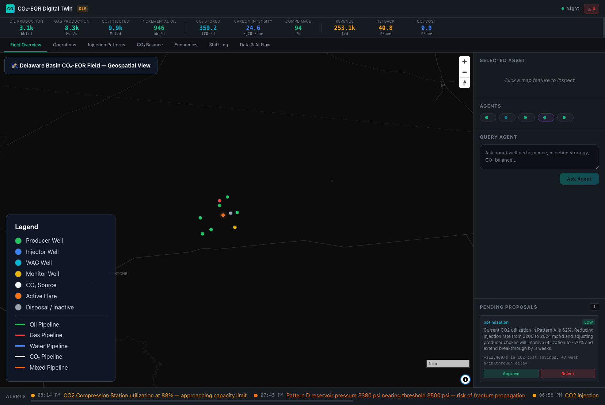
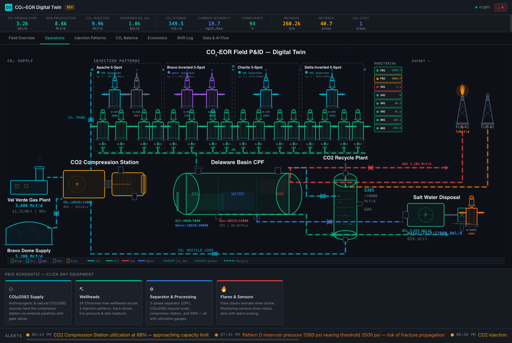

[](https://databricks.com)
[](https://docs.databricks.com/en/data-governance/unity-catalog/index.html)
[](https://docs.databricks.com/en/compute/serverless.html)

# CO₂-EOR Digital Twin

A real-time digital twin command center for CO₂ Enhanced Oil Recovery field operations in the Delaware Basin. Built as a [Databricks App](https://docs.databricks.com/en/dev-tools/databricks-apps/index.html) using Express.js, React, and MapLibre GL, this solution demonstrates geospatial field monitoring, multi-agent AI advisory, injection pattern optimization, and carbon accounting on the Databricks Lakehouse Platform.



## Overview

CO₂-EOR (Enhanced Oil Recovery) uses supercritical carbon dioxide injection to mobilize residual oil from mature reservoirs while permanently storing CO₂ underground. Managing these operations requires real-time visibility across wells, injection patterns, facilities, and carbon balance. This accelerator delivers:

- **Geospatial Field Overview** — MapLibre GL interactive map with CARTO dark basemap showing all wells (producers, injectors, WAG), pipelines, facilities, CO₂ sources, monitoring points, and fleet vehicles with real-time status
- **Operations Dashboard** — Digital twin P&ID visualization with live well status, flow rates, pressures, and equipment health across the field
- **Injection Pattern Monitoring** — Pattern-level CO₂ injection rates, WAG ratios, reservoir pressure tracking, and utilization metrics across 4 flood patterns
- **CO₂ Balance & Storage** — Carbon accounting dashboard tracking injected, recycled, purchased, and stored CO₂ volumes with compliance metrics
- **Well Economics** — Per-well and field-level economic analysis with revenue, OpEx, CO₂ costs, and netback calculations
- **Multi-Agent AI Advisory** — Five specialized AI agents (monitoring, optimization, maintenance, commercial, orchestrator) providing contextual recommendations


## Architecture

```
┌─────────────────────────────────────────────────────────────────┐
│  Field Sensors & SCADA                                          │
│  24 wells × 10+ tags each → telemetry stream                    │
└──────────────────────────┬──────────────────────────────────────┘
                           │
                    ┌──────▼──────┐
                    │   Bronze    │  Raw telemetry, well tests, events
                    ├─────────────┤
                    │   Silver    │  Cleaned readings, pattern metrics
                    ├─────────────┤
                    │    Gold     │  KPIs, economics, CO₂ balance
                    └──────┬──────┘
                           │
              ┌────────────┼────────────┐
              │            │            │
        ┌─────▼────┐ ┌────▼─────┐ ┌───▼──────┐
        │Monitoring│ │  Optim.  │ │Commercial│
        │  Agent   │ │  Agent   │ │  Agent   │
        └─────┬────┘ └────┬─────┘ └───┬──────┘
              │            │            │
              └────────────┼────────────┘
                           │
                    ┌──────▼──────┐
                    │   React +   │  Databricks App
                    │  Express.js │  7-tab command center
                    └─────────────┘
```

## Wells Monitored

| Pattern | Producers | Injectors | Key Metrics |
|---------|-----------|-----------|-------------|
| Pattern A | W-A01, W-A02, W-A03, W-A04 | W-INJ-A1, W-INJ-A2 | Primary CO₂ flood, highest utilization |
| Pattern B | W-B01, W-B02, W-B03 | W-INJ-B1, W-WAG-B1 | WAG injection, gas breakthrough monitoring |
| Pattern C | W-C01, W-C02, W-C03 | W-INJ-C1, W-INJ-C2 | Mature flood, water cut management |
| Pattern D | W-D01, W-D02, W-D03, W-D04 | W-INJ-D1, W-WAG-D1 | High-pressure zone, fracture risk monitoring |

**Total: 14 producers, 6 injectors, 4 WAG wells — 24 wells across 4 patterns**

## Sensor Channels

| Parameter | Unit | Operational Relevance |
|-----------|------|----------------------|
| Oil Rate | bbl/d | Production performance, decline analysis |
| Gas Rate | Mcf/d | GOR tracking, CO₂ breakthrough detection |
| Water Rate | bbl/d | Water cut monitoring, sweep efficiency |
| CO₂ Injection Rate | Mcf/d | Flood management, storage accounting |
| Bottomhole Pressure | psi | Reservoir management, fracture avoidance |
| Tubing/Casing Pressure | psi | Well integrity, flow assurance |
| CO₂ Concentration | % | Recycling requirements, breakthrough timing |
| Water Cut | % | Sweep efficiency, pattern maturity |
| GOR | scf/bbl | Gas breakthrough, production optimization |

## Dashboard Tabs


| Tab | Description |
|-----|-------------|
| **Field Overview** | MapLibre GL geospatial map with wells, pipelines, facilities, CO₂ sources, and real-time agent advisory panel |
| **Operations** | Digital twin visualization with well status cards, flow rates, pressures, and equipment health |
| **Injection Patterns** | Pattern-level injection metrics, WAG ratios, CO₂ utilization, and reservoir pressure monitoring |
| **CO₂ Balance** | Carbon accounting — injected vs. recycled vs. purchased vs. stored, compliance tracking |
| **Economics** | Per-well revenue, OpEx, CO₂ costs, netback analysis, and incremental EOR economics |
| **Shift Log** | Operational shift handover log with timestamped events and notes |
| **Data & AI Flow** | Interactive architecture diagram showing the medallion pipeline from SCADA through agents |



## AI Agents

| Agent | Role | Capabilities |
|-------|------|-------------|
| **Monitoring** | Real-time surveillance | Pressure alerts, water cut trends, CO₂ breakthrough detection |
| **Optimization** | Production optimization | Choke adjustments, WAG ratio tuning, injection rate recommendations |
| **Maintenance** | Equipment health | Workover scheduling, ESP monitoring, facility maintenance |
| **Commercial** | Economic analysis | Revenue forecasting, CO₂ cost optimization, netback analysis |
| **Orchestrator** | Multi-agent coordination | Cross-agent recommendation synthesis, priority ranking |

## Geospatial Features


The Field Overview uses MapLibre GL JS with CARTO dark basemap to render:

- **Well markers** — Color-coded by type (producer/injector/WAG/monitor) with status indicators
- **Pipeline network** — Oil (green), gas (red), water (blue), CO₂ (dark), mixed (orange) pipelines
- **Facilities** — Central processing, compression station, CO₂ recycle plant, water treatment
- **CO₂ sources** — Anthropogenic capture facilities and natural CO₂ reservoirs
- **Monitoring points** — Soil gas, groundwater, and seismic monitoring stations
- **Fleet vehicles** — Field crew and equipment locations

## Getting Started

### Prerequisites

- A Databricks workspace with [Databricks Apps](https://docs.databricks.com/en/dev-tools/databricks-apps/index.html) enabled
- Databricks CLI installed and configured
- Node.js 18+ (for local development)

### Deploy as a Databricks App

1. Import the compiled app into your workspace:
   ```bash
   databricks workspace import-dir ./dist /Workspace/Users/<your-email>/co2-eor-twin/dist --overwrite
   databricks workspace import-dir ./ui/dist /Workspace/Users/<your-email>/co2-eor-twin/ui/dist --overwrite
   databricks workspace import-file ./app.yaml /Workspace/Users/<your-email>/co2-eor-twin/app.yaml --overwrite
   databricks workspace import-file ./package.json /Workspace/Users/<your-email>/co2-eor-twin/package.json --overwrite
   ```

2. Create and deploy the app:
   ```bash
   databricks apps create co2-eor-twin --description "CO2-EOR Digital Twin Command Center"
   databricks apps deploy co2-eor-twin --source-code-path /Workspace/Users/<your-email>/co2-eor-twin
   ```

3. Open the app URL printed by the deploy command.

### Local Development

1. Install dependencies and build:
   ```bash
   npm install
   cd ui && npm install && npm run build && cd ..
   npm run build
   ```

2. Start the server:
   ```bash
   npm start
   ```

## Tech Stack

| Layer | Technology |
|-------|-----------|
| **Frontend** | React 18, MapLibre GL JS, Vite |
| **Backend** | Express.js, TypeScript |
| **Geospatial** | MapLibre GL JS, OpenFreeMap (OSM), GeoJSON |
| **Deployment** | Databricks Apps |
| **Data** | Unity Catalog, Delta Lake (medallion architecture) |

## Project Support

Please note the code in this project is provided for your exploration only, and is not formally supported by Databricks with Service Level Agreements (SLAs). It is provided AS-IS and we do not make any guarantees of any kind. Please do not submit a support ticket relating to any issues arising from the use of this project.

Any issues discovered through the use of this project should be filed as GitHub Issues on this repository. They will be reviewed on a best-effort basis but no formal SLA or support is guaranteed.


## License

**Definitions.**

**Agreement:** The agreement between Databricks, Inc., and you governing the use of the Databricks Services, as that term is defined in the Master Cloud Services Agreement (MCSA) located at www.databricks.com/legal/mcsa.

**Licensed Materials:** The source code, object code, data, and/or other works to which this license applies.

**Scope of Use.** You may not use the Licensed Materials except in connection with your use of the Databricks Services pursuant to the Agreement. Your use of the Licensed Materials must comply at all times with any restrictions applicable to the Databricks Services, generally, and must be used in accordance with any applicable documentation. You may view, use, copy, modify, publish, and/or distribute the Licensed Materials solely for the purposes of using the Licensed Materials within or connecting to the Databricks Services. If you do not agree to these terms, you may not view, use, copy, modify, publish, and/or distribute the Licensed Materials.

**Redistribution.** You may redistribute and sublicense the Licensed Materials so long as all use is in compliance with these terms. In addition:

- You must give any other recipients a copy of this License;
- You must cause any modified files to carry prominent notices stating that you changed the files;
- You must retain, in any derivative works that you distribute, all copyright, patent, trademark, and attribution notices, excluding those notices that do not pertain to any part of the derivative works; and
- If a "NOTICE" text file is provided as part of its distribution, then any derivative works that you distribute must include a readable copy of the attribution notices contained within such NOTICE file, excluding those notices that do not pertain to any part of the derivative works.

You may add your own copyright statement to your modifications and may provide additional license terms and conditions for use, reproduction, or distribution of your modifications, or for any such derivative works as a whole, provided your use, reproduction, and distribution of the Licensed Materials otherwise complies with the conditions stated in this License.

**Termination.** This license terminates automatically upon your breach of these terms or upon the termination of your Agreement. Additionally, Databricks may terminate this license at any time on notice. Upon termination, you must permanently delete the Licensed Materials and all copies thereof.

**DISCLAIMER; LIMITATION OF LIABILITY.**

THE LICENSED MATERIALS ARE PROVIDED "AS-IS" AND WITH ALL FAULTS. DATABRICKS, ON BEHALF OF ITSELF AND ITS LICENSORS, SPECIFICALLY DISCLAIMS ALL WARRANTIES RELATING TO THE LICENSED MATERIALS, EXPRESS AND IMPLIED, INCLUDING, WITHOUT LIMITATION, IMPLIED WARRANTIES, CONDITIONS AND OTHER TERMS OF MERCHANTABILITY, SATISFACTORY QUALITY OR FITNESS FOR A PARTICULAR PURPOSE, AND NON-INFRINGEMENT. DATABRICKS AND ITS LICENSORS TOTAL AGGREGATE LIABILITY RELATING TO OR ARISING OUT OF YOUR USE OF OR DATABRICKS' PROVISIONING OF THE LICENSED MATERIALS SHALL BE LIMITED TO ONE THOUSAND ($1,000) DOLLARS. IN NO EVENT SHALL THE AUTHORS OR COPYRIGHT HOLDERS BE LIABLE FOR ANY CLAIM, DAMAGES OR OTHER LIABILITY, WHETHER IN AN ACTION OF CONTRACT, TORT OR OTHERWISE, ARISING FROM, OUT OF OR IN CONNECTION WITH THE LICENSED MATERIALS OR THE USE OR OTHER DEALINGS IN THE LICENSED MATERIALS.
