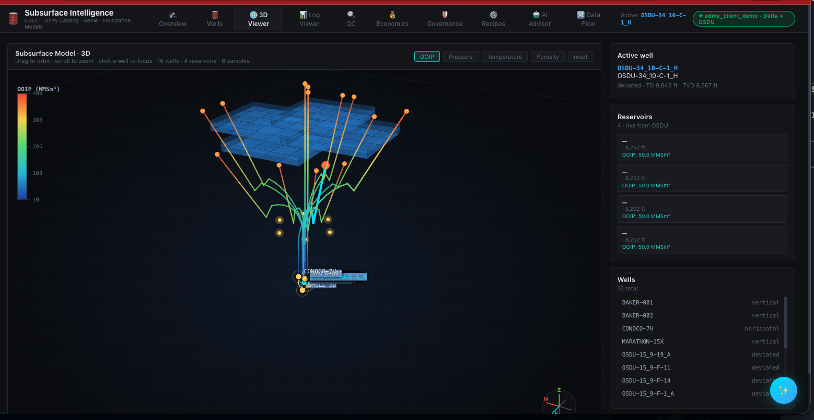
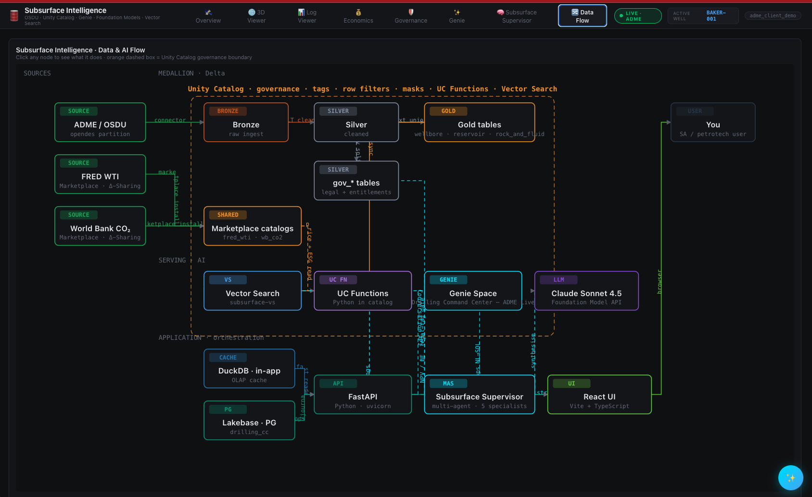
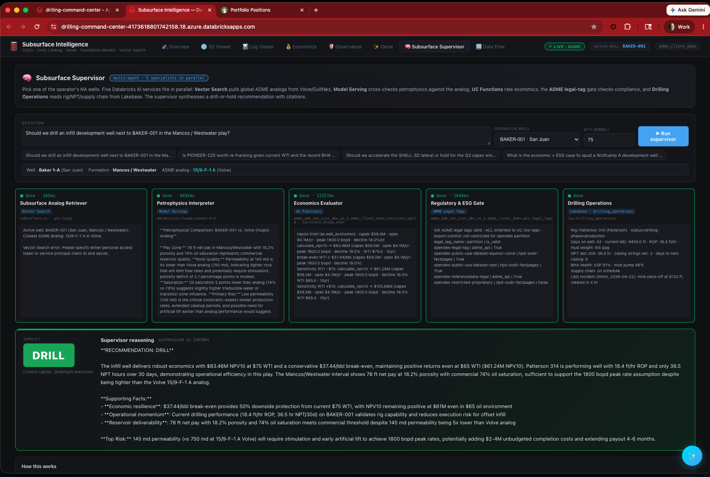

[](https://databricks.com)
[](https://docs.databricks.com/en/data-governance/unity-catalog/index.html)
[](https://learn.microsoft.com/en-us/azure/energy-data-services/)
[](https://docs.databricks.com/aws/en/genie/)

# Drilling Command Center — OSDU + ADME

An eight-tab subsurface and drilling command center built as a [Databricks App](https://docs.databricks.com/en/dev-tools/databricks-apps/index.html) on **Azure Data Manager for Energy (ADME)** and **Unity Catalog**. FastAPI + React + Lakebase (managed PostgreSQL 16) + Foundation Model API + Vector Search + a **Subsurface Supervisor** multi-agent system that fires five Databricks AI services in parallel for drill-or-hold recommendations, plus a floating **Genie** chat for cross-domain OSDU questions.

This solution accelerator demonstrates how upstream operators and oilfield services teams can move from disconnected subsurface tools to a single, governed command center that consumes OSDU master and work-product data directly from ADME, layered with 3D digital twin visualization, economics, governance, and a multi-agent AI supervisor that produces evidence-backed development recommendations.





## Disclaimer

This is a **solution accelerator**, not a production-ready application. It is provided as reference code to demonstrate patterns for integrating OSDU / ADME data with Databricks Apps, Unity Catalog, Lakebase, and Genie. It has not been hardened or security-audited for production workloads. Review, adapt, and validate the code in your own environment before any operational use. Databricks makes no warranty regarding fitness for any particular purpose. See [LICENSE](LICENSE) and the repository-level [DISCLAIMER.md](../DISCLAIMER.md).

## Overview

The Drilling Command Center brings subsurface, drilling, completions, economics, and governance data into a single live surface so engineers can answer cross-domain questions without writing SQL or waiting on a slide deck:

- **Live OSDU integration** — pulls Wellbore, Reservoir, and Rock & Fluid master records from ADME via the Search v2 API, with cursor pagination, retry, and incremental refresh.
- **Subsurface Supervisor (multi-agent AI)** — five Databricks AI services run in parallel against an operator question, then a supervisor synthesises an evidence-backed drill-or-hold recommendation with citations. See the dedicated section below.
- **Floating Genie chat** — Genie Space scoped to the curated OSDU tables sits as a slide-in panel on every tab, so the natural-language interface is one click away regardless of where the user is.
- **Lakebase journal** — drilling notes, supervisor history, governance audit, and alert state persist in a managed PostgreSQL 16 instance, attached as a Databricks App resource.
- **3D Digital Twin** — interactive 3D well-trajectory and reservoir layer viewer for the active basin, with OOIP / pressure / temperature / porosity color overlays.
- **Economics module** — live WTI prices feed into per-well NPV / IRR / payout calculations and supervisor sensitivities.
- **Unity Catalog governance** — every query, every table, every Genie answer, every supervisor citation inherits UC permissions, lineage, and audit trail.

## Architecture

| Layer | Component | Purpose |
|---|---|---|
| Sources | **Azure Data Manager for Energy (ADME)** | OSDU master + work-product data via Search v2 API (opendes partition) |
| Sources | **FRED WTI** (Databricks Marketplace, Delta Sharing) | Live oil price feed for economics module |
| Sources | **World Bank CO2** (Databricks Marketplace, Delta Sharing) | CO2 reference data for ESG / Governance tab |
| Ingestion | **Auto Loader + DLT** | Bronze → Silver → Gold OSDU normalization (de-dup on `modifyTime`) |
| Storage | **Bronze (raw ingest)** | Unfiltered ADME page payloads with audit trail |
| Storage | **Silver (cleaned)** | Normalized OSDU records, schema flattened, dedup applied |
| Storage | **Silver (`gov_*` tables)** | Legal tags + entitlements mirrored from ADME |
| Storage | **Gold (app-ready)** | `wellbore`, `reservoir`, `rock_and_fluid` curated tables |
| Compute | **Databricks SQL Warehouse** | App-time queries against the curated OSDU tables |
| AI | **Vector Search** (`subsurface-vs` + `gte-large`) | Subsurface Analog Retriever over global ADME analogs |
| AI | **UC Functions** (Python in catalog) | Economics Evaluator (`calculate_npv10`, `calculate_break_even`) |
| AI | **Genie Space** | Cross-domain natural-language interface over the OSDU + gov_* tables |
| AI | **Foundation Model API** (Claude Sonnet 4.5) | Petrophysics Interpreter agent grounded in the analog well |
| AI | **Multi-Agent Supervisor (MAS)** | Orchestrates the five specialists and synthesises the drill-or-hold verdict |
| App backend | **FastAPI + asyncpg** | REST + SSE endpoints, connection pool to Lakebase |
| App cache | **DuckDB (in-app, OLAP cache)** | Local materialised projections for hot tabs |
| App storage | **Lakebase PostgreSQL 16** (`drilling_cc`) | Drilling journal, supervisor history, alert state |
| App frontend | **React + TypeScript + Vite** | Eight tabs + floating Genie panel |
| Governance | **Unity Catalog** (dashed boundary in the diagram) | Permissions, lineage, audit, tags, row filters, masks across every layer |

## Dashboard Tabs

| Tab | Description |
|-----|-------------|
| **Overview** | Active well summary, basin KPIs, fleet status, recent alerts. |
| **3D Viewer** | Interactive 3D well-trajectory and reservoir layer visualization with OOIP / Pressure / Temperature / Porosity color overlays. Live OSDU well list and per-well reservoir cards on the side panel. |
| **Log Viewer** | Multi-track SVG log viewer for petrophysical curves (GR, RT, RHOB, NPHI, DT) with QC overlays and formation boundaries. |
| **Economics** | Live WTI prices feeding per-well NPV / IRR / break-even and payout calculations, sensitivities at +/- $10 WTI. |
| **Governance** | Unity Catalog legal tags, entitlements, audit trail, CO2 metadata, persona-level access matrix, end-to-end UC chain. |
| **Genie** | Embedded Genie Space tab for natural-language OSDU queries across the curated tables. |
| **Subsurface Supervisor** | Multi-agent drill-or-hold recommendation engine. Five Databricks AI services run in parallel and a supervisor synthesises a verdict with citations. See dedicated section below. |
| **Data Flow** | Interactive architecture diagram showing the end-to-end OSDU → Databricks → App pipeline. |
| **Genie (floating)** | Slide-in chat anchored on every tab. Genie Space scoped to the curated OSDU tables. One click from any view. |

## Subsurface Supervisor — Multi-Agent Drill-or-Hold

The Subsurface Supervisor tab is the marquee AI workflow. The user picks an operator well and asks an open development question (for example, "Should we drill an infill development well next to BAKER-001 in the Mancos / Westwater play?"). Five Databricks AI services then fire **in parallel**, each returning evidence within seconds:

| Specialist | Databricks primitive | Job |
|---|---|---|
| **Subsurface Analog Retriever** | Vector Search (`subsurface-vs` + `gte-large`) | Pulls global ADME analogs from public datasets (Volve, Gullfaks) for the active well's formation and depth window. |
| **Petrophysics Interpreter** | Model Serving (Claude Sonnet 4.5) | Cross-checks petrophysics (porosity, saturation, net pay) of the active well against the analog and flags primary risks. |
| **Economics Evaluator** | UC Functions (`calculate_npv10`, `calculate_break_even`) | Computes NPV10, break-even WTI, and price sensitivities directly from `las.well_economics` inputs. |
| **Regulatory & ESG Gate** | ADME Legal Tags | Validates legal tag count, ACL inheritance to UC row tags, export control, and partition compliance. |
| **Drilling Operations** | Lakebase (`las.drilling_operations`) | Pulls active rig status, NPT, mud weight, casing strings, BHA health, and supply chain from the live Lakebase journal. |

The **Supervisor** then synthesises the five outputs into a single verdict (**DRILL** or **HOLD**) with supporting facts, a numbered risk list, and inline citations to each specialist's evidence card. End-to-end latency is typically 15-25 seconds for a five-specialist run.



This pattern showcases the Databricks AI platform substrate working as a coordinated whole: Vector Search for analog retrieval, Model Serving for grounded LLM reasoning, UC Functions for governed numeric calculation, ADME Legal Tags for compliance, and Lakebase for live operational state. The supervisor is itself a Databricks Model Serving endpoint that composes the parallel calls and emits the final reasoning. Mosaic AI Gateway sits in front of every endpoint for cost, safety, and audit governance.

## OSDU Entities

Three OSDU master-data kinds are ingested by default:

| Kind | OSDU schema | Use case |
|---|---|---|
| `master-data--Wellbore` | `osdu:wks:master-data--Wellbore:1.0.0` | Wellbore registry, header records, status, location, depth |
| `master-data--Reservoir` | `osdu:wks:master-data--Reservoir:1.0.0` | Reservoir master records, layers, pressure / temperature attributes |
| `master-data--Rock_and_Fluid` | `osdu:wks:master-data--Rock_and_Fluid:1.0.0` | Petrophysical and PVT properties |

The connector is straightforward to extend to additional OSDU kinds (work-product collections, reference data, log curves) by adding new domain configurations.

## Lakebase Schema

The Drilling Command Center uses Lakebase Postgres 16 for app-side state. Core tables:

| Table | Purpose |
|---|---|
| `drilling_journal` | Engineer-entered notes, anchored to a well or basin |
| `ai_advisor_history` | Chat sessions and turn-by-turn responses with FM API |
| `alerts` | Active operational and quality alerts with severity and acknowledgement state |
| `osdu_cache` | Short-TTL cache of OSDU Search v2 responses for warm tabs |
| `wti_prices` | WTI spot price history for the economics module |
| `governance_audit` | Local mirror of UC audit events relevant to the active basin |
| `personas` | Persona to access-level mapping for the governance tab |

## Getting Started

### Prerequisites

- An **Azure Databricks** workspace with [Databricks Apps](https://docs.databricks.com/en/dev-tools/databricks-apps/index.html) enabled and on the same Microsoft Entra ID tenant as your ADME instance.
- [**Lakebase**](https://docs.databricks.com/en/lakebase/index.html) provisioned in the workspace.
- A **Databricks SQL Warehouse** with access to the curated OSDU Unity Catalog tables.
- A **Genie Space** configured against the curated OSDU tables (see [Genie docs](https://docs.databricks.com/aws/en/genie/)).
- **Foundation Model API** enabled (Claude Sonnet 4.6 endpoint).
- The Databricks CLI installed and authenticated.
- Node.js 18+ for the frontend build.

### 1. Land OSDU data into Unity Catalog

If you have not already ingested ADME data into Unity Catalog, use the [OSDU ADME Connector](../osdu-app-with-connector/) accelerator in this repository to land Wellbore, Reservoir, and Rock & Fluid into Bronze / Silver Delta tables on Unity Catalog. Take note of the catalog and schema names; you will set them as environment variables for this app.

### 2. Configure `app.yaml`

Edit `app.yaml` and set:

- `ADME_CATALOG` — Unity Catalog name where curated OSDU tables live
- `ADME_SCHEMA` — schema within that catalog
- `DATABRICKS_WAREHOUSE_ID` — SQL warehouse ID for ADME queries
- `GENIE_SPACE_ID` — Genie Space ID scoped to the OSDU tables

### 3. Build the frontend

```bash
cd frontend
npm install
npm run build
cd ..
```

### 4. Deploy the app

```bash
# Authenticate to your workspace
databricks auth login --host https://YOUR-WORKSPACE.azuredatabricks.net

# Import the source to your workspace
databricks workspace import-dir . /Workspace/Users/YOU@YOUR_ORG/drilling-command-center --overwrite

# Deploy the app
databricks apps deploy drilling-command-center \
  --source-code-path /Workspace/Users/YOU@YOUR_ORG/drilling-command-center
```

The first start can take 60-90 seconds while the OSDU seed and cache warm-up complete in the background. Subsequent reloads are fast because hot tabs stay cached.

### 5. (Optional) Use Databricks Asset Bundles

The `databricks.yml` defines a bundle target for parameterized deployments. See [DEPLOY.md](DEPLOY.md) for the full bundle workflow.

## Repository Layout

```
drilling-command-center/
├── app.py                  # FastAPI entrypoint, startup tasks, static serving
├── app.yaml                # Databricks App config, Lakebase resource, env vars
├── databricks.yml          # Asset Bundle config
├── DEPLOY.md               # Deployment guide
├── requirements.txt        # Python dependencies
├── server/
│   ├── db.py               # asyncpg pool to Lakebase
│   ├── lakebase.py         # Lakebase helpers
│   ├── osdu_live.py        # ADME Search v2 client
│   ├── prices.py           # WTI price feed
│   ├── schema.py           # Lakebase DDL + seed data
│   └── routes/             # FastAPI route modules per tab
├── frontend/
│   ├── src/
│   │   └── components/     # React tab components (Overview, Wells, ...)
│   ├── index.html
│   ├── package.json
│   └── vite.config.ts
├── icons/                  # SVG icons used by the React UI
├── images/                 # README assets
├── tests/                  # Backend tests
├── CONTRIBUTING.md
├── LICENSE
├── NOTICE
└── SECURITY.md
```

## Related Solutions in This Repository

- [**OSDU ADME Connector**](../osdu-app-with-connector/) — Data engineering accelerator that lands OSDU master + governance data into Unity Catalog. Run this first if you do not already have OSDU data in UC.
- [**LAS Viewer**](../las-viewer/) — Petrophysics-focused well log visualization with its own QC and processing recipes.
- [**Reservoir Simulator**](../reservoir-simulator/) — 3D reservoir simulation calibrated to the Norne field benchmark.

## Contributing

See [CONTRIBUTING.md](CONTRIBUTING.md) for the contribution workflow. Feedback, issues, and pull requests are welcome.
