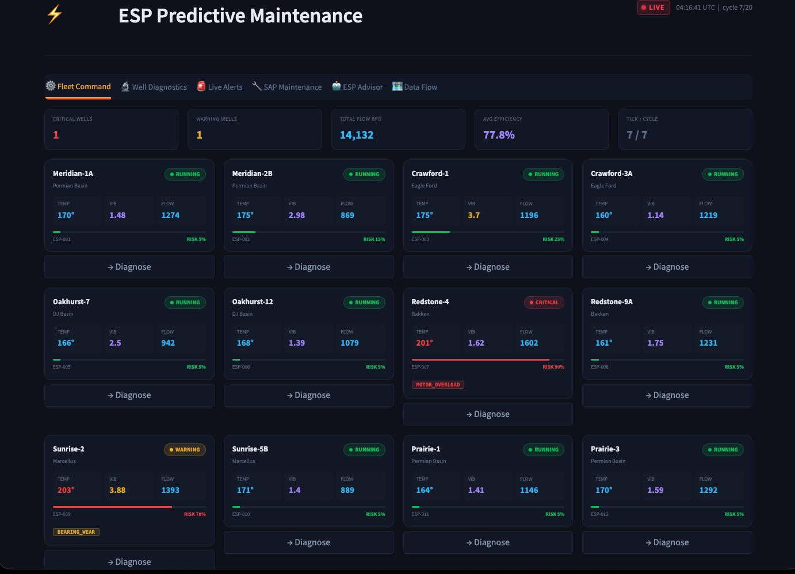
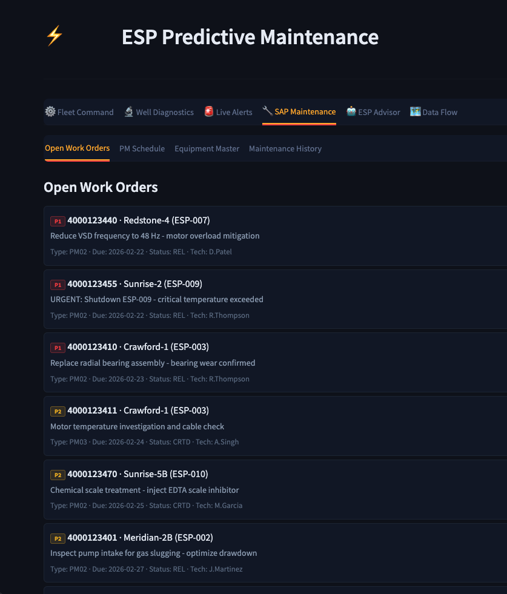
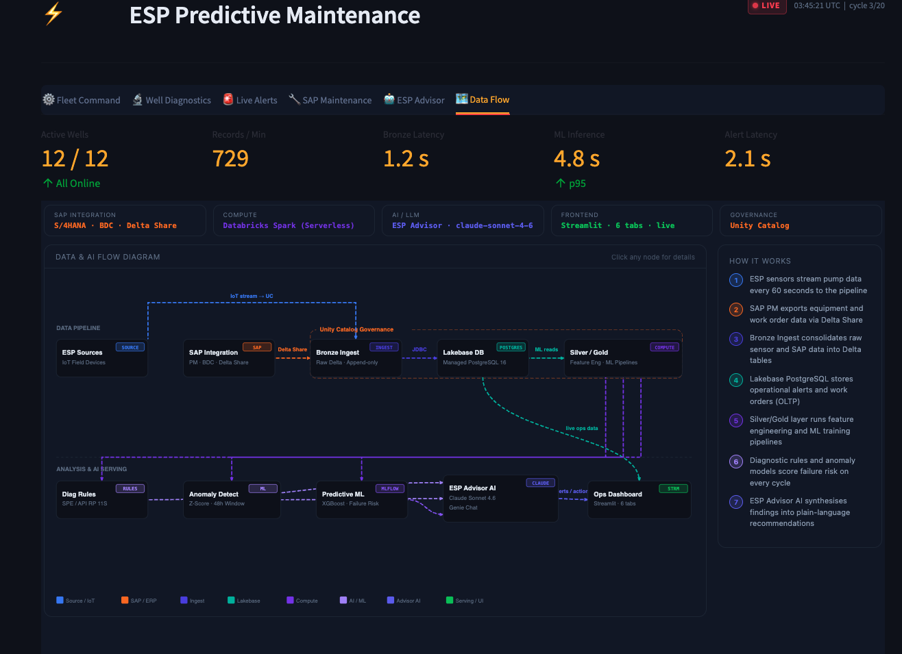
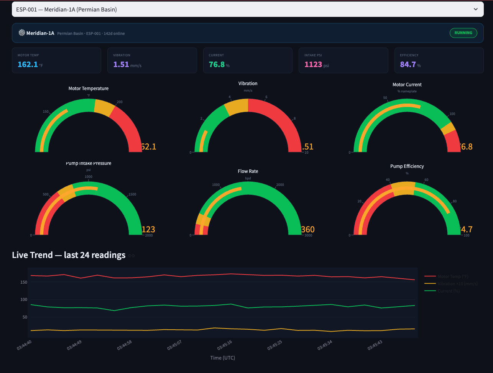

[](https://databricks.com)
[](https://docs.databricks.com/en/data-governance/unity-catalog/index.html)
[](https://docs.databricks.com/en/compute/serverless.html)

# ESP Predictive Maintenance

A real-time Electric Submersible Pump (ESP) monitoring and failure prediction platform built as a [Databricks App](https://docs.databricks.com/en/dev-tools/databricks-apps/index.html). This solution accelerator demonstrates an end-to-end ML pipeline — from telemetry ingestion through feature engineering, XGBoost model training, streaming inference, and an operational Streamlit dashboard — for upstream oil & gas artificial lift systems.



## Overview

ESPs are the most common form of artificial lift in unconventional oil production. Unplanned failures cost operators $100K–$500K per event in workover costs and deferred production. This accelerator delivers:

- **Fleet Command Dashboard** — Real-time monitoring of 12 ESP wells across Permian Basin, Eagle Ford, DJ Basin, Bakken, and Marcellus with health scores, failure risk, and production KPIs
- **Well Diagnostics** — Physics-based diagnostic rules engine (API RP 11S series) detecting motor overload, gas interference, bearing wear, high temperature, scale buildup, and pump degradation
- **Live Alerts** — Streaming anomaly detection with configurable thresholds, alert history, and automatic severity classification
- **SAP Maintenance Integration** — Work order tracking, spare parts inventory, vendor management, and planned-vs-reactive maintenance KPIs



- **ESP Advisor** — Foundation Model API-powered AI assistant for well-specific troubleshooting and optimization recommendations
- **Data & AI Flow** — Interactive architecture diagram showing the medallion pipeline from SCADA ingestion through Bronze/Silver/Gold to ML serving

## Architecture



## Wells Monitored

| ESP ID | Well Name | Field | Depth (ft) | HP | Initial Stage |
|--------|-----------|-------|------------|-----|---------------|
| ESP-001 | Meridian-1A | Permian Basin | 8,500 | 150 | Healthy |
| ESP-002 | Meridian-2B | Permian Basin | 8,200 | 125 | Gas Interference |
| ESP-003 | Crawford-1 | Eagle Ford | 9,100 | 200 | Bearing Wear |
| ESP-004 | Crawford-3A | Eagle Ford | 9,300 | 175 | Healthy |
| ESP-005 | Oakhurst-7 | DJ Basin | 7,200 | 100 | Pump Wear |
| ESP-006 | Oakhurst-12 | DJ Basin | 7,400 | 100 | Healthy |
| ESP-007 | Redstone-4 | Bakken | 10,200 | 250 | Overload |
| ESP-008 | Redstone-9A | Bakken | 10,400 | 225 | Healthy |
| ESP-009 | Sunrise-2 | Marcellus | 11,500 | 300 | Critical Temp |
| ESP-010 | Sunrise-5B | Marcellus | 11,200 | 275 | Scale Buildup |
| ESP-011 | Prairie-1 | Permian Basin | 8,900 | 150 | Healthy |
| ESP-012 | Prairie-3 | Permian Basin | 8,700 | 150 | Healthy |

## Sensor Channels

| Parameter | Unit | Diagnostic Relevance |
|-----------|------|---------------------|
| Motor Temperature | °F | Insulation breakdown, cooling loss |
| Intake Pressure (PIP) | psi | Gas interference, pump-off |
| Discharge Pressure | psi | Tubing restriction, scale buildup |
| Motor Current | % nameplate | Overload, locked rotor, underload |
| Vibration | mm/s | Bearing wear, shaft misalignment |
| Flow Rate | bpd | Production decline, pump degradation |
| Pump Efficiency | % | Wear ring clearance, gas locking |
| Insulation Resistance | MΩ | Winding degradation, moisture ingress |

## Dashboard Tabs



| Tab | Description |
|-----|-------------|
| **Fleet Command** | Real-time fleet overview with health gauges, failure risk scores, and production KPIs across all 12 wells |
| **Well Diagnostics** | Per-well deep dive with sensor trends, diagnostic fault codes, and root cause analysis |
| **Live Alerts** | Streaming alert feed with severity-based filtering, acknowledgment, and alert history |
| **SAP Maintenance** | Work order management, spare parts inventory, vendor tracking, planned vs reactive KPIs |
| **ESP Advisor** | AI-powered troubleshooting assistant using Foundation Model API |
| **Data & AI Flow** | Interactive architecture diagram showing the end-to-end data pipeline |

## Simulated Event Cycle

The simulator runs a 20-tick cycle to demonstrate real-time anomaly detection:

| Ticks | Event | Affected Well |
|-------|-------|---------------|
| 0–4 | Temperature spike | ESP-009 Sunrise-2 |
| 5–9 | Motor overload surge | ESP-007 Redstone-4 |
| 10–14 | Bearing failure escalation | ESP-003 Crawford-1 |
| 15–19 | Gas interference surge | ESP-002 Meridian-2B |

## ML Pipeline (Notebooks)

| Notebook | Description |
|----------|-------------|
| `02_feature_engineering.py` | Rolling telemetry statistics, physics-derived scores, SAP maintenance features → `esp_ai.gold.esp_features` |
| `03_label_generation.py` | Binary failure labels with 72-hour lookahead window → `esp_ai.gold.esp_failure_labels` |
| `04_model_training.py` | XGBoost classifier with temporal train/val/test split, SHAP explanations, MLflow logging → registered model |
| `05_inference_streaming.py` | Structured Streaming job scoring new telemetry in near-real-time |

## DDL Scripts

| Script | Description |
|--------|-------------|
| `01_esp_ai_delta_tables.sql` | Unity Catalog setup — `esp_ai` catalog with raw/ref/gold/app schemas and Delta tables |
| `02_sap_curated_views.sql` | Curated views over SAP PM/MM data for maintenance integration |
| `03_lakebase_app_postgres.sql` | Lakebase PostgreSQL schema for alerts, work orders, and app state |

## Getting Started

### Prerequisites

- A Databricks workspace with [Databricks Apps](https://docs.databricks.com/en/dev-tools/databricks-apps/index.html), [Lakebase](https://docs.databricks.com/en/lakebase/index.html), and a SQL Warehouse
- Databricks CLI installed and configured
- Unity Catalog enabled

### Deploy the Databricks App

1. Update `app.yaml` with your warehouse ID and Lakebase instance name.

2. Import the app into your workspace:
   ```bash
   databricks workspace import-dir ./app /Workspace/Users/<your-email>/esp-pm/app --overwrite
   databricks workspace import-file ./app.yaml /Workspace/Users/<your-email>/esp-pm/app.yaml --overwrite
   ```

3. Create and deploy:
   ```bash
   databricks apps create esp-pm --description "ESP Predictive Maintenance"
   databricks apps deploy esp-pm --source-code-path /Workspace/Users/<your-email>/esp-pm
   ```

### Set Up the ML Pipeline

1. Run the DDL scripts in order (`ddl/01_*`, `ddl/02_*`, `ddl/03_*`) on a SQL Warehouse.
2. Import notebooks to your workspace and run or schedule them via Databricks Jobs (see `jobs/` for JSON definitions).
3. Optionally run `seed_demo_data.py` to populate sample telemetry.

## Project Support

Please note the code in this project is provided for your exploration only, and is not formally supported by Databricks with Service Level Agreements (SLAs). It is provided AS-IS and we do not make any guarantees of any kind. Please do not submit a support ticket relating to any issues arising from the use of this project.

Any issues discovered through the use of this project should be filed as GitHub Issues on this repository. They will be reviewed on a best-effort basis but no formal SLA or support is guaranteed.


## License

**Definitions.**

**Agreement:** The agreement between Databricks, Inc., and you governing the use of the Databricks Services, as that term is defined in the Master Cloud Services Agreement (MCSA) located at www.databricks.com/legal/mcsa.

**Licensed Materials:** The source code, object code, data, and/or other works to which this license applies.

**Scope of Use.** You may not use the Licensed Materials except in connection with your use of the Databricks Services pursuant to the Agreement. Your use of the Licensed Materials must comply at all times with any restrictions applicable to the Databricks Services, generally, and must be used in accordance with any applicable documentation. You may view, use, copy, modify, publish, and/or distribute the Licensed Materials solely for the purposes of using the Licensed Materials within or connecting to the Databricks Services. If you do not agree to these terms, you may not view, use, copy, modify, publish, and/or distribute the Licensed Materials.

**Redistribution.** You may redistribute and sublicense the Licensed Materials so long as all use is in compliance with these terms. In addition:

- You must give any other recipients a copy of this License;
- You must cause any modified files to carry prominent notices stating that you changed the files;
- You must retain, in any derivative works that you distribute, all copyright, patent, trademark, and attribution notices, excluding those notices that do not pertain to any part of the derivative works; and
- If a "NOTICE" text file is provided as part of its distribution, then any derivative works that you distribute must include a readable copy of the attribution notices contained within such NOTICE file, excluding those notices that do not pertain to any part of the derivative works.

You may add your own copyright statement to your modifications and may provide additional license terms and conditions for use, reproduction, or distribution of your modifications, or for any such derivative works as a whole, provided your use, reproduction, and distribution of the Licensed Materials otherwise complies with the conditions stated in this License.

**Termination.** This license terminates automatically upon your breach of these terms or upon the termination of your Agreement. Additionally, Databricks may terminate this license at any time on notice. Upon termination, you must permanently delete the Licensed Materials and all copies thereof.

**DISCLAIMER; LIMITATION OF LIABILITY.**

THE LICENSED MATERIALS ARE PROVIDED "AS-IS" AND WITH ALL FAULTS. DATABRICKS, ON BEHALF OF ITSELF AND ITS LICENSORS, SPECIFICALLY DISCLAIMS ALL WARRANTIES RELATING TO THE LICENSED MATERIALS, EXPRESS AND IMPLIED, INCLUDING, WITHOUT LIMITATION, IMPLIED WARRANTIES, CONDITIONS AND OTHER TERMS OF MERCHANTABILITY, SATISFACTORY QUALITY OR FITNESS FOR A PARTICULAR PURPOSE, AND NON-INFRINGEMENT. DATABRICKS AND ITS LICENSORS TOTAL AGGREGATE LIABILITY RELATING TO OR ARISING OUT OF YOUR USE OF OR DATABRICKS' PROVISIONING OF THE LICENSED MATERIALS SHALL BE LIMITED TO ONE THOUSAND ($1,000) DOLLARS. IN NO EVENT SHALL THE AUTHORS OR COPYRIGHT HOLDERS BE LIABLE FOR ANY CLAIM, DAMAGES OR OTHER LIABILITY, WHETHER IN AN ACTION OF CONTRACT, TORT OR OTHERWISE, ARISING FROM, OUT OF OR IN CONNECTION WITH THE LICENSED MATERIALS OR THE USE OR OTHER DEALINGS IN THE LICENSED MATERIALS.
