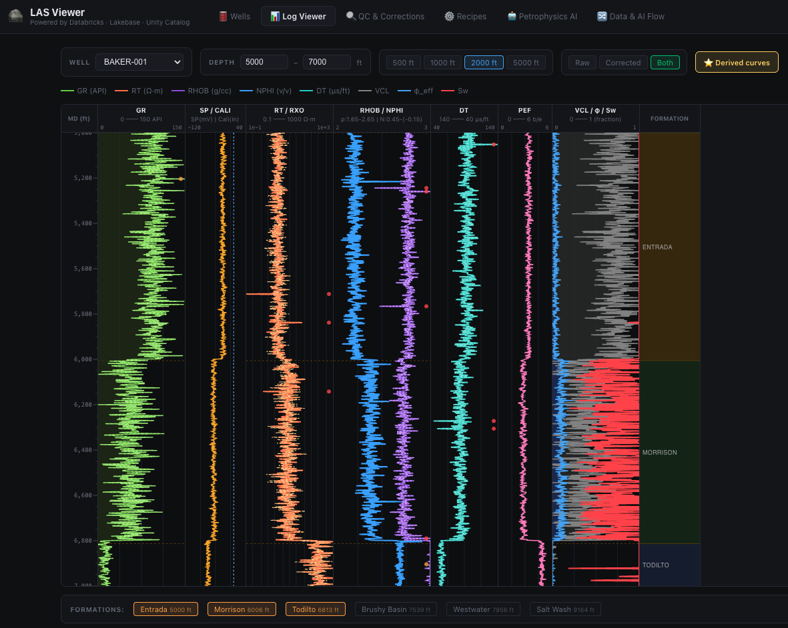
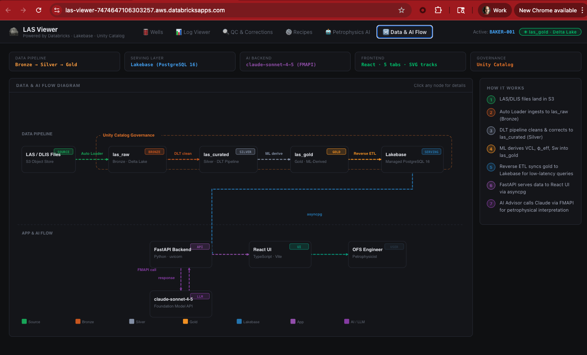
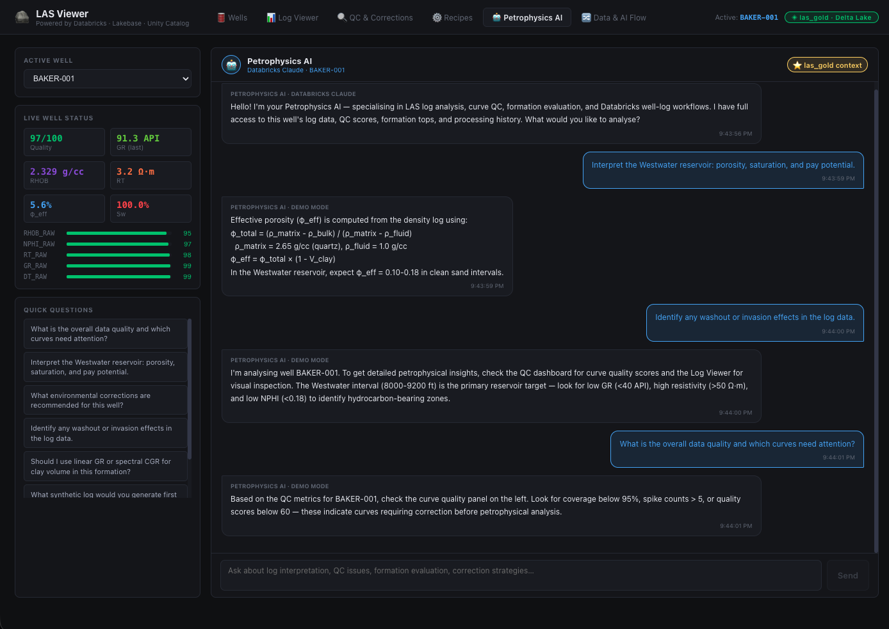

[](https://databricks.com)
[](https://docs.databricks.com/en/data-governance/unity-catalog/index.html)
[](https://docs.databricks.com/en/compute/serverless.html)

# LAS Viewer — Well Log Visualization & Petrophysics Platform

An enterprise-grade well logging visualization and analysis platform built as a [Databricks App](https://docs.databricks.com/en/dev-tools/databricks-apps/index.html). LAS Viewer combines a React/TypeScript frontend with a FastAPI backend, Lakebase (managed PostgreSQL), and Foundation Model API to deliver interactive log curve viewing, automated QC, processing recipes, and AI-powered petrophysical advisory for upstream oil & gas operations.



## Overview

LAS (Log ASCII Standard) files are the backbone of well log data exchange in the petroleum industry. LAS Viewer provides a complete workflow from raw log ingestion through quality control, environmental corrections, petrophysical derivations, and AI-assisted interpretation:

- **Interactive Log Curve Viewer** — SVG-based multi-track display showing raw curves (GR, RT, RHOB, NPHI, DT, etc.), QC flags, corrected curves, and derived petrophysical properties with formation boundary overlays
- **Automated Quality Control** — Spike detection, gap identification, range validation, and washout flagging with per-curve quality scores
- **Processing Recipes** — Configurable workflows from corporate standard petrophysical processing to fast drilling turnaround to high-fidelity reservoir simulation
- **Petrophysics AI Advisor** — Foundation Model API-powered recommendations for well completion and development strategies
- **Data & AI Flow** — Interactive architecture diagram showing the medallion pipeline from LAS file ingestion through Bronze/Silver/Gold to serving

## Architecture



## Dashboard Tabs



| Tab | Description |
|-----|-------------|
| **Wells** | Browse 6 sample wells with metadata, location, depth, spud date, status, and quality scores |
| **Log Viewer** | Interactive SVG multi-track display: raw curves, QC flags, corrected curves, derived petrophysical properties, and formation tops |
| **QC** | Quality control dashboard with spike, gap, range, and washout anomaly detection per curve |
| **Recipes** | Processing recipe management — Corporate Standard, Fast Drilling Turnaround, High-Fidelity Reservoir Sim |
| **Advisor** | AI-powered petrophysics advisor using Foundation Model API for well completion recommendations |
| **Data & AI Flow** | Interactive architecture diagram showing the end-to-end data pipeline |

## Well Log Curves

| Curve | Description | Unit |
|-------|-------------|------|
| GR | Gamma Ray | API |
| RT | Deep Resistivity | ohm·m |
| RXO | Shallow Resistivity | ohm·m |
| RHOB | Bulk Density | g/cm³ |
| NPHI | Neutron Porosity | v/v |
| DT | Sonic (Compressional) | μs/ft |
| CALI | Caliper | in |
| SP | Spontaneous Potential | mV |
| PEF | Photoelectric Factor | b/e |

**Derived properties:** Clay Volume (VCl), Total Porosity (φ_total), Effective Porosity (φ_eff), Water Saturation (Sw via Archie equation)

## Database Schema

Seven tables in the `las` schema on Lakebase (PostgreSQL 16):

| Table | Description |
|-------|-------------|
| `wells` | Well metadata — location, depth range, spud date, status, quality score |
| `depth_logs` | Curve measurements at each depth with QC flags |
| `formation_tops` | Geological formation boundaries (Entrada, Morrison, Todilto, etc.) |
| `curve_quality` | Per-curve quality metrics — coverage %, spike count, gap count |
| `qc_rules` | Configurable QC rule definitions (range checks, spike detection) |
| `processing_recipes` | Predefined processing workflows with JSON step definitions |
| `processing_runs` | Execution history of recipes with metrics |
| `anomalies` | Detected data quality issues (washouts, karst, synthetic sonic needed) |

## Getting Started

### Prerequisites

- A Databricks workspace with [Databricks Apps](https://docs.databricks.com/en/dev-tools/databricks-apps/index.html) and [Lakebase](https://docs.databricks.com/en/lakebase/index.html) enabled
- Databricks CLI installed and configured
- Node.js 18+ (for frontend build)

### Build the Frontend

```bash
cd frontend
npm install
npm run build
cd ..
```

### Deploy as a Databricks App

1. Import the app into your workspace:
   ```bash
   databricks workspace import-dir . /Workspace/Users/<your-email>/las-viewer --overwrite
   ```

2. Create and deploy:
   ```bash
   databricks apps create las-viewer --description "Well Log Visualization & Petrophysics Platform"
   databricks apps deploy las-viewer --source-code-path /Workspace/Users/<your-email>/las-viewer
   ```

3. The app auto-creates the Lakebase database and seeds sample well data on first startup.

## Tech Stack

| Layer | Technology |
|-------|-----------|
| **Frontend** | React 18 + TypeScript 5.6 + Vite 5.4 + Recharts |
| **Database** | Lakebase (Databricks managed PostgreSQL 16) |
| **AI** | Foundation Model API (Petrophysics Advisor) |
| **Visualization** | Native SVG for log curve tracks |

## Project Support

Please note the code in this project is provided for your exploration only, and is not formally supported by Databricks with Service Level Agreements (SLAs). It is provided AS-IS and we do not make any guarantees of any kind. Please do not submit a support ticket relating to any issues arising from the use of this project.

Any issues discovered through the use of this project should be filed as GitHub Issues on this repository. They will be reviewed on a best-effort basis but no formal SLA or support is guaranteed.

## Third-Party Library Licenses

(c) 2025 Databricks, Inc. All rights reserved. The source in this project is provided subject to the [Databricks License](LICENSE). All included or referenced third-party libraries are subject to the licenses set forth below.

| Library | License | Source |
|---------|---------|--------|
| react | MIT | https://github.com/facebook/react |
| react-dom | MIT | https://github.com/facebook/react |
| recharts | MIT | https://github.com/recharts/recharts |
| vite | MIT | https://github.com/vitejs/vite |
| typescript | Apache 2.0 | https://github.com/microsoft/TypeScript |
