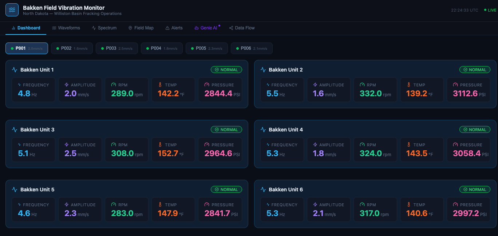
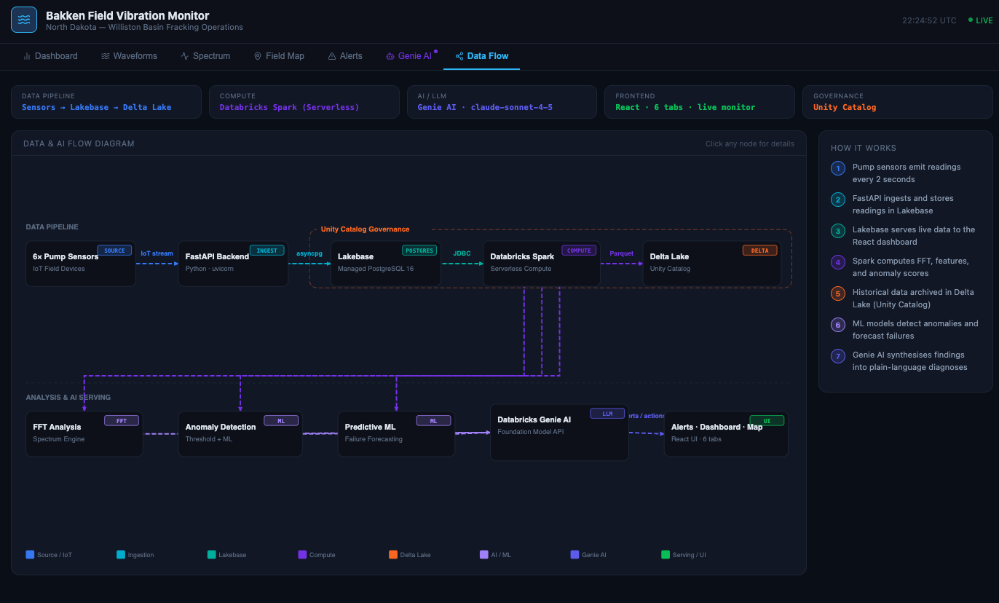
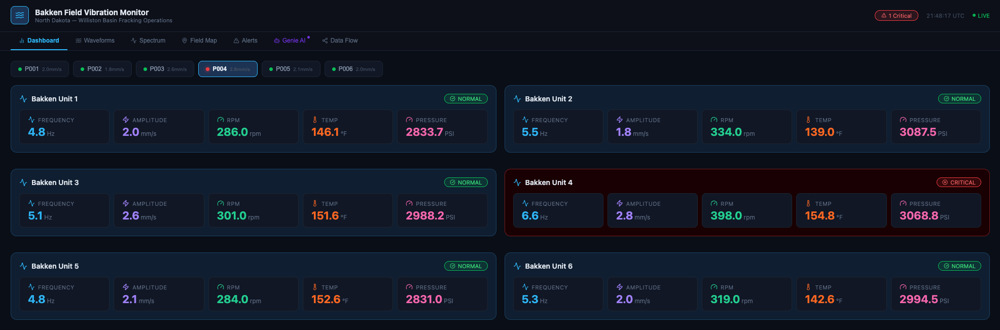
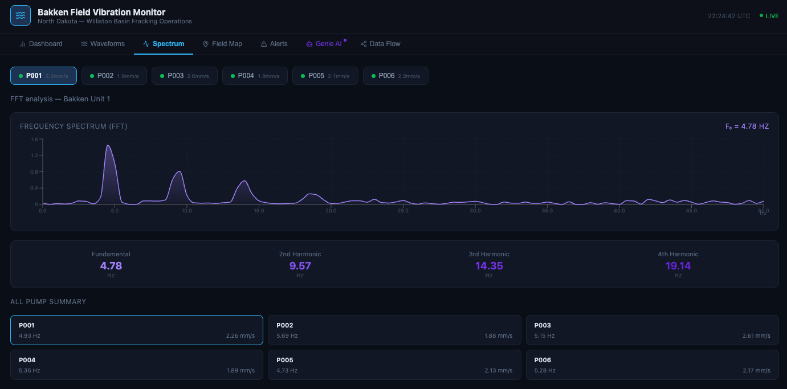

[](https://databricks.com)
[](https://docs.databricks.com/en/data-governance/unity-catalog/index.html)
[](https://docs.databricks.com/en/compute/serverless.html)

# Oil Pump Vibration Monitor

A real-time oil pump vibration monitoring platform built as a [Databricks App](https://docs.databricks.com/en/dev-tools/databricks-apps/index.html) with a React frontend and FastAPI backend. This solution accelerator demonstrates live vibration analysis, FFT spectrum visualization, anomaly detection, and an AI operations assistant for upstream oil & gas fracking operations in the North Dakota Bakken Formation.



## Overview

Fracking pump failures from undetected vibration anomalies — bearing faults, cavitation, imbalance, and overspeed — cause costly unplanned downtime. This accelerator delivers:

- **Live Metrics Dashboard** — Real-time vibration amplitude, RPM, temperature, and pressure for 6 Bakken Formation pumps with 2-second refresh
- **Waveform Analysis** — Time-domain vibration waveform visualization with historical trend overlays
- **FFT Spectrum** — Frequency-domain analysis revealing harmonic patterns indicative of bearing faults, imbalance, or cavitation
- **Field Map** — Geographic visualization of pump locations across the Bakken field
- **Alert Panel** — Streaming anomaly alerts with severity classification (normal / warning / critical)
- **Genie AI Assistant** — Foundation Model API-powered operations AI that diagnoses faults, analyzes trends, and recommends corrective actions using live sensor data
- **Data Flow Diagram** — Interactive architecture diagram showing the end-to-end data pipeline

## Architecture



| Layer | Technology |
|-------|-----------|
| **Frontend** | React 18, TypeScript, Vite, Recharts, Lucide React |
| **Database** | Lakebase (managed PostgreSQL) |
| **AI** | Databricks Foundation Model API (Claude) via OpenAI-compatible SDK |
| **Deployment** | Databricks Apps |

## Pumps Monitored

| Pump ID | Name | Location | RPM | Frequency | Amplitude | Temp (°F) | Pressure (PSI) |
|---------|------|----------|-----|-----------|-----------|-----------|----------------|
| PUMP-ND-001 | Bakken Unit 1 - Williston | 48.15°N, 103.62°W | 280 | 4.67 Hz | 2.1 mm/s | 145 | 2,850 |
| PUMP-ND-002 | Bakken Unit 2 - Tioga | 48.40°N, 102.94°W | 320 | 5.33 Hz | 1.8 mm/s | 138 | 3,100 |
| PUMP-ND-003 | Bakken Unit 3 - Stanley | 48.32°N, 102.39°W | 295 | 4.92 Hz | 2.4 mm/s | 152 | 2,950 |
| PUMP-ND-004 | Bakken Unit 4 - Watford City | 47.80°N, 103.29°W | 310 | 5.17 Hz | 1.9 mm/s | 141 | 3,050 |
| PUMP-ND-005 | Bakken Unit 5 - Parshall | 47.95°N, 102.14°W | 275 | 4.58 Hz | 2.2 mm/s | 149 | 2,800 |
| PUMP-ND-006 | Bakken Unit 6 - New Town | 47.97°N, 102.49°W | 305 | 5.08 Hz | 2.0 mm/s | 143 | 3,000 |

## Anomaly Detection



The simulator injects anomalies with 3% probability per reading. The AI agent recognizes these fault signatures:

| Fault Type | Vibration Signature | Operational Impact |
|-----------|-------------------|-------------------|
| **Bearing Fault** | Amplitude 2.5–4× baseline, elevated 2nd/3rd harmonics | Critical — structural damage risk |
| **Cavitation** | Erratic amplitude, pressure drop >200 PSI | Warning — pump damage risk |
| **Imbalance** | Elevated 1× fundamental, amplitude >1.5× baseline | Warning — accelerated wear |
| **Overspeed** | RPM >400, high frequency, elevated temperature | Critical — thermal shutdown risk |



## Getting Started

### Prerequisites

- A Databricks workspace with [Databricks Apps](https://docs.databricks.com/en/dev-tools/databricks-apps/index.html) and [Lakebase](https://docs.databricks.com/en/lakebase/index.html)
- Databricks CLI installed and configured

### Deploy with Databricks Asset Bundles (recommended)

```bash
databricks bundle deploy -t dev
databricks bundle run -t dev
```

### Deploy manually

1. Import the app into your workspace:
   ```bash
   databricks workspace import-dir . /Workspace/Users/<your-email>/oil-pump-monitor --overwrite
   ```

2. Create and deploy:
   ```bash
   databricks apps create oil-pump-monitor --description "Oil Pump Vibration Monitor"
   databricks apps deploy oil-pump-monitor --source-code-path /Workspace/Users/<your-email>/oil-pump-monitor
   ```

The app will automatically:
- Initialize the Lakebase PostgreSQL schema (pumps, vibration_readings, spectrum_readings)
- Seed demo pump data for the 6 Bakken units
- Start the background vibration simulator

### Build the Frontend (development)

```bash
cd frontend
npm install
npm run build
```

The built assets in `frontend/dist/` are already included in the repository for deployment.

## Database Schema

| Table | Description |
|-------|-------------|
| `pumps` | Pump definitions — ID, name, GPS coordinates, field section, status |
| `vibration_readings` | Time-series vibration data — frequency, amplitude, RPM, temperature, pressure, alert level |
| `spectrum_readings` | FFT spectrum snapshots — frequency bins (0–50 Hz) with amplitude arrays |

## Project Support

Please note the code in this project is provided for your exploration only, and is not formally supported by Databricks with Service Level Agreements (SLAs). It is provided AS-IS and we do not make any guarantees of any kind. Please do not submit a support ticket relating to any issues arising from the use of this project.

Any issues discovered through the use of this project should be filed as GitHub Issues on this repository. They will be reviewed on a best-effort basis but no formal SLA or support is guaranteed.

## Third-Party Library Licenses

(c) 2025 Databricks, Inc. All rights reserved. The source in this project is provided subject to the [Databricks License](LICENSE). All included or referenced third-party libraries are subject to the licenses set forth below.

| Library | License | Source |
|---------|---------|--------|
| react | MIT | https://github.com/facebook/react |
| recharts | MIT | https://github.com/recharts/recharts |
| lucide-react | ISC | https://github.com/lucide-icons/lucide |
| vite | MIT | https://github.com/vitejs/vite |
| typescript | Apache 2.0 | https://github.com/microsoft/TypeScript |


## License

**Definitions.**

**Agreement:** The agreement between Databricks, Inc., and you governing the use of the Databricks Services, as that term is defined in the Master Cloud Services Agreement (MCSA) located at www.databricks.com/legal/mcsa.

**Licensed Materials:** The source code, object code, data, and/or other works to which this license applies.

**Scope of Use.** You may not use the Licensed Materials except in connection with your use of the Databricks Services pursuant to the Agreement. Your use of the Licensed Materials must comply at all times with any restrictions applicable to the Databricks Services, generally, and must be used in accordance with any applicable documentation. You may view, use, copy, modify, publish, and/or distribute the Licensed Materials solely for the purposes of using the Licensed Materials within or connecting to the Databricks Services. If you do not agree to these terms, you may not view, use, copy, modify, publish, and/or distribute the Licensed Materials.

**Redistribution.** You may redistribute and sublicense the Licensed Materials so long as all use is in compliance with these terms. In addition:

- You must give any other recipients a copy of this License;
- You must cause any modified files to carry prominent notices stating that you changed the files;
- You must retain, in any derivative works that you distribute, all copyright, patent, trademark, and attribution notices, excluding those notices that do not pertain to any part of the derivative works; and
- If a "NOTICE" text file is provided as part of its distribution, then any derivative works that you distribute must include a readable copy of the attribution notices contained within such NOTICE file, excluding those notices that do not pertain to any part of the derivative works.

You may add your own copyright statement to your modifications and may provide additional license terms and conditions for use, reproduction, or distribution of your modifications, or for any such derivative works as a whole, provided your use, reproduction, and distribution of the Licensed Materials otherwise complies with the conditions stated in this License.

**Termination.** This license terminates automatically upon your breach of these terms or upon the termination of your Agreement. Additionally, Databricks may terminate this license at any time on notice. Upon termination, you must permanently delete the Licensed Materials and all copies thereof.

**DISCLAIMER; LIMITATION OF LIABILITY.**

THE LICENSED MATERIALS ARE PROVIDED "AS-IS" AND WITH ALL FAULTS. DATABRICKS, ON BEHALF OF ITSELF AND ITS LICENSORS, SPECIFICALLY DISCLAIMS ALL WARRANTIES RELATING TO THE LICENSED MATERIALS, EXPRESS AND IMPLIED, INCLUDING, WITHOUT LIMITATION, IMPLIED WARRANTIES, CONDITIONS AND OTHER TERMS OF MERCHANTABILITY, SATISFACTORY QUALITY OR FITNESS FOR A PARTICULAR PURPOSE, AND NON-INFRINGEMENT. DATABRICKS AND ITS LICENSORS TOTAL AGGREGATE LIABILITY RELATING TO OR ARISING OUT OF YOUR USE OF OR DATABRICKS' PROVISIONING OF THE LICENSED MATERIALS SHALL BE LIMITED TO ONE THOUSAND ($1,000) DOLLARS. IN NO EVENT SHALL THE AUTHORS OR COPYRIGHT HOLDERS BE LIABLE FOR ANY CLAIM, DAMAGES OR OTHER LIABILITY, WHETHER IN AN ACTION OF CONTRACT, TORT OR OTHERWISE, ARISING FROM, OUT OF OR IN CONNECTION WITH THE LICENSED MATERIALS OR THE USE OR OTHER DEALINGS IN THE LICENSED MATERIALS.
