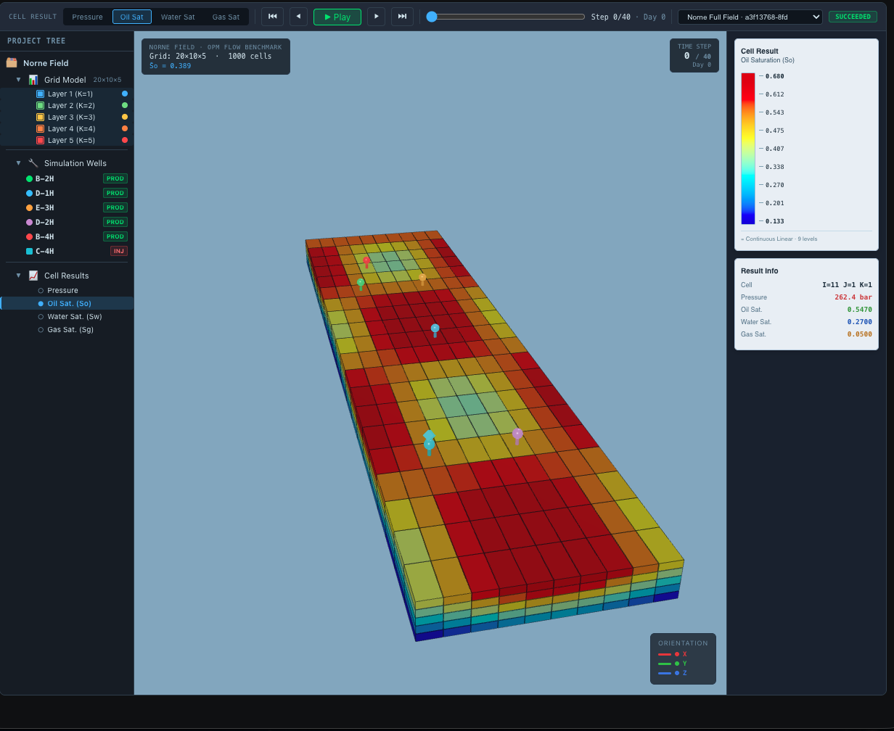
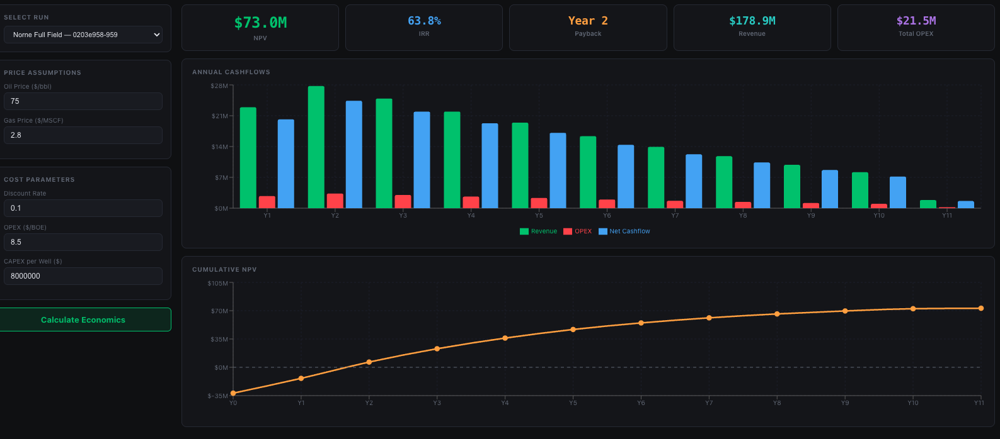
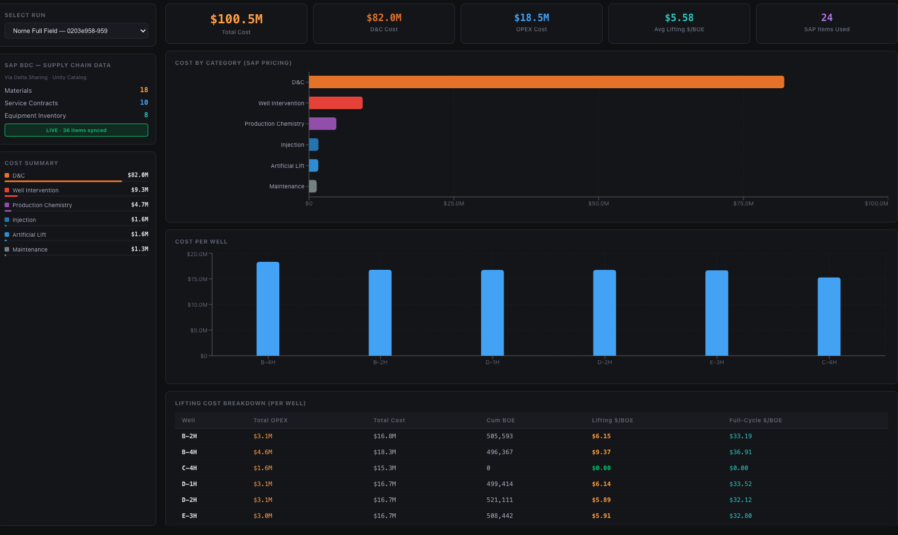
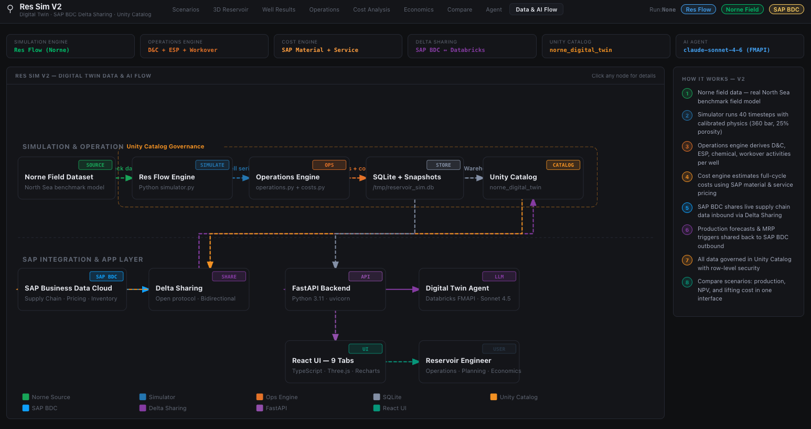
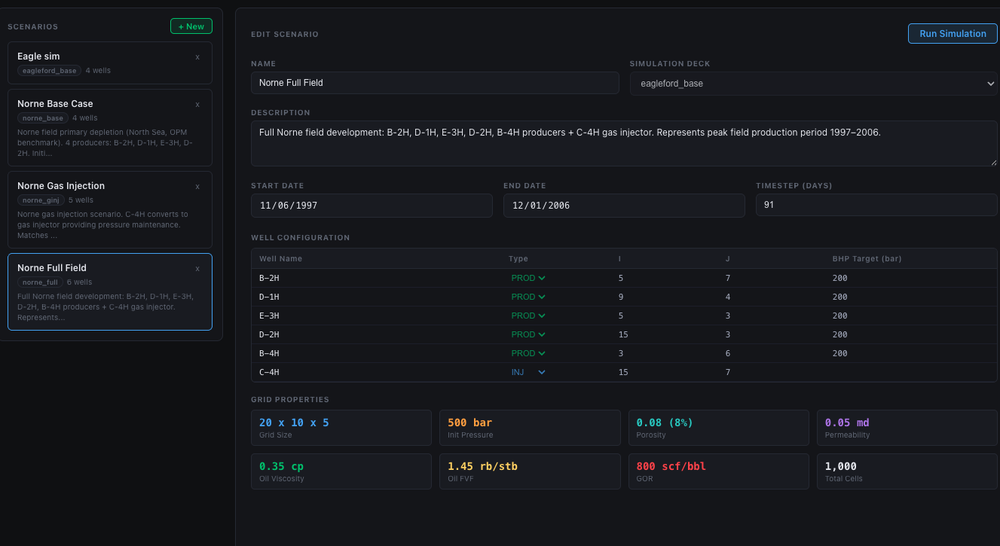
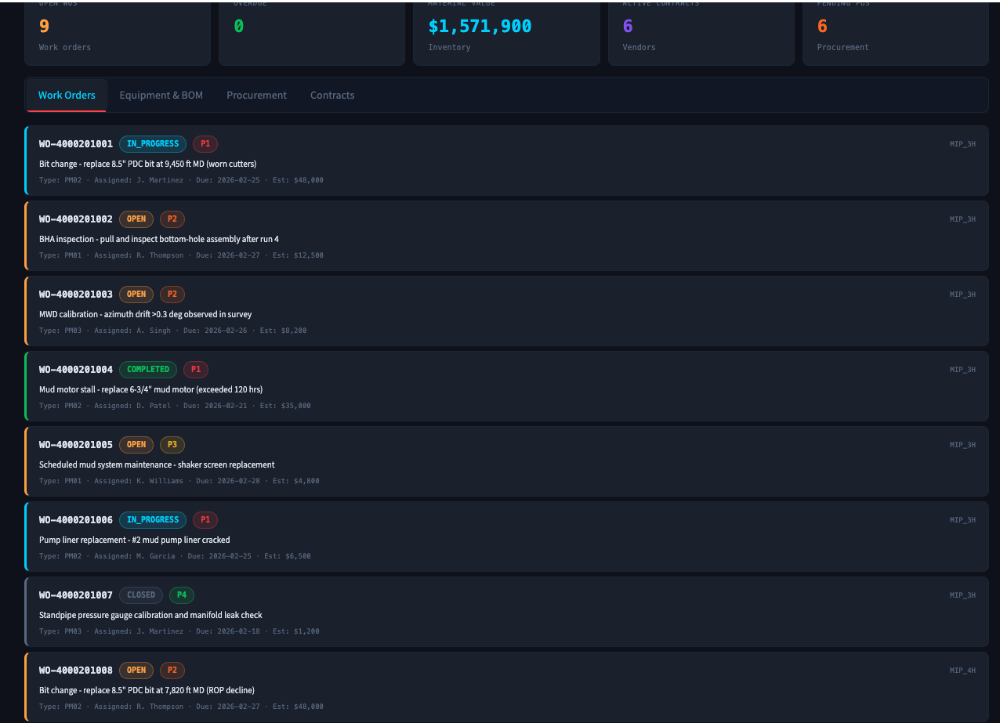

[](https://databricks.com)
[](https://docs.databricks.com/en/data-governance/unity-catalog/index.html)
[](https://docs.databricks.com/en/compute/serverless.html)

# Reservoir Simulator

A real-time reservoir simulation and production optimization platform built as a [Databricks App](https://docs.databricks.com/en/dev-tools/databricks-apps/index.html). This solution accelerator demonstrates an interactive 3D reservoir model — with scenario management, well performance analysis, economic evaluation, and SAP ERP integration — for upstream oil & gas reservoir engineering workflows. The simulator uses a simplified analytical engine calibrated to the [Norne field](https://opm-project.org/?page_id=559) (North Sea) benchmark dataset.



## Overview

Reservoir simulation is the cornerstone of field development planning. A single simulation study can influence $100M+ in capital allocation decisions. This accelerator delivers:

- **Scenario Management** — Create, configure, and compare simulation scenarios with adjustable well rates, injection strategies, and economic assumptions
- **3D Reservoir Visualization** — Interactive Three.js-powered 3D viewport with oil/water saturation heatmaps, well trajectories, and layer-by-layer navigation
- **Well Results** — Per-well production profiles (oil, water, gas), cumulative curves, water cut trends, and GOR tracking across simulation timesteps
- **Operations** — Operational KPIs, well status monitoring, and field-level production summaries



- **Cost Analysis** — Detailed cost breakdown with SAP BDC integration for CAPEX/OPEX tracking, procurement, and vendor contracts



- **Economics** — NPV, IRR, payout period, and cashflow analysis with configurable oil price, discount rate, and fiscal terms
- **Scenario Comparison** — Side-by-side comparison of multiple simulation runs with production, economics, and efficiency metrics
- **Reservoir Agent** — Foundation Model API-powered AI assistant for natural-language reservoir analysis and optimization recommendations
- **Data & AI Flow** — Interactive architecture diagram showing the end-to-end pipeline from Norne data through simulation to serving

## Architecture



## Dashboard Tabs



| Tab | Description |
|-----|-------------|
| **Scenarios** | Create and manage simulation scenarios with well configuration, injection rates, and economic parameters |
| **3D Reservoir** | Interactive Three.js viewport with oil/water saturation, pressure distribution, well paths, and layer navigation |
| **Well Results** | Per-well production curves (oil, water, gas), cumulative production, water cut, and GOR over time |
| **Operations** | Field-level operational KPIs, well status, and production summary |
| **Cost Analysis** | CAPEX/OPEX breakdown with SAP BDC integration, procurement tracking, and vendor contracts |
| **Economics** | NPV, IRR, payout, cashflow waterfall with configurable price decks and fiscal assumptions |
| **Compare** | Side-by-side scenario comparison with production, economics, and efficiency delta analysis |
| **Agent** | AI-powered reservoir engineering assistant using Foundation Model API |
| **Data & AI Flow** | Interactive architecture diagram showing the simulation pipeline |



## Reservoir Model

The Res Flow engine is a lightweight analytical simulator calibrated to the [Norne field](https://opm-project.org/?page_id=559) — a real North Sea oil field operated by Equinor. It uses distance-based pressure decline, saturation tracking, and heuristic production curves on a representative sub-grid (the full Norne deck is 46×112×22). Res Flow reproduces realistic field behavior for demonstration and visualization purposes:

| Parameter | Value |
|-----------|-------|
| Grid | 20 × 10 × 5 (1,000 cells) |
| Timesteps | 40 |
| Porosity | 0.15 – 0.30 |
| Permeability | 50 – 500 mD |
| Initial Pressure | 3,000 psi |
| Oil Viscosity | 2.0 cp |
| Water Viscosity | 0.5 cp |

## Wells

| Well | Type | Location | Description |
|------|------|----------|-------------|
| B-2H | Producer | (5, 3) | Primary producer, north sector |
| D-1H | Producer | (15, 7) | Primary producer, south sector |
| E-3H | Producer | (10, 5) | Central producer |
| D-2H | Producer | (8, 8) | Secondary producer |
| C-4H | Injector | (10, 5) | Water injection for pressure support |

## Tech Stack

| Component | Technology |
|-----------|------------|
| Backend | FastAPI + Uvicorn |
| Frontend | React 18 + TypeScript + Vite |
| 3D Rendering | Three.js + React Three Fiber + Drei |
| Charts | Recharts |
| Simulation Engine | Python analytical model (NumPy + SciPy) |
| Data Platform | Databricks SQL Warehouse + Unity Catalog |
| Local State | SQLite |

## Getting Started

### Prerequisites

- A Databricks workspace with [Databricks Apps](https://docs.databricks.com/en/dev-tools/databricks-apps/index.html) and a SQL Warehouse
- Databricks CLI installed and configured
- Unity Catalog enabled
- Node.js 18+ (for frontend builds)

### Deploy with Databricks Asset Bundles (recommended)

```bash
databricks bundle deploy -t dev
databricks bundle run -t dev
```

### Deploy manually

1. Update `app.yaml` with your SQL Warehouse ID.

2. Import the app into your workspace:
   ```bash
   databricks workspace import-dir ./server /Workspace/Users/<your-email>/reservoir-simulator/server --overwrite
   databricks workspace import-dir ./frontend /Workspace/Users/<your-email>/reservoir-simulator/frontend --overwrite
   databricks workspace import-file ./app.yaml /Workspace/Users/<your-email>/reservoir-simulator/app.yaml --overwrite
   ```

3. Create and deploy:
   ```bash
   databricks apps create reservoir-simulator --description "Reservoir Simulator"
   databricks apps deploy reservoir-simulator --source-code-path /Workspace/Users/<your-email>/reservoir-simulator
   ```

### Run Locally

```bash
# Backend
pip install -r requirements.txt
uvicorn app:app --host 0.0.0.0 --port 8000

# Frontend (development)
cd frontend
npm install
npm run dev
```

## Project Support

Please note the code in this project is provided for your exploration only, and is not formally supported by Databricks with Service Level Agreements (SLAs). It is provided AS-IS and we do not make any guarantees of any kind. Please do not submit a support ticket relating to any issues arising from the use of this project.

Any issues discovered through the use of this project should be filed as GitHub Issues on this repository. They will be reviewed on a best-effort basis but no formal SLA or support is guaranteed.

## Third-Party Library Licenses

(c) 2025 Databricks, Inc. All rights reserved. The source in this project is provided subject to the [Databricks License](LICENSE). All included or referenced third-party libraries are subject to the licenses set forth below.

### Backend Dependencies

| Library | License | Source |
|---------|---------|--------|
| fastapi | MIT | https://github.com/tiangolo/fastapi |
| uvicorn | BSD 3-Clause | https://github.com/encode/uvicorn |
| databricks-sdk | Databricks License | https://github.com/databricks/databricks-sdk-py |
| databricks-sql-connector | Apache 2.0 | https://github.com/databricks/databricks-sql-python |
| numpy | BSD 3-Clause | https://github.com/numpy/numpy |
| scipy | BSD 3-Clause | https://github.com/scipy/scipy |
| websockets | BSD 3-Clause | https://github.com/python-websockets/websockets |

### Frontend Dependencies

| Library | License | Source |
|---------|---------|--------|
| react | MIT | https://github.com/facebook/react |
| three | MIT | https://github.com/mrdoob/three.js |
| @react-three/fiber | MIT | https://github.com/pmndrs/react-three-fiber |
| @react-three/drei | MIT | https://github.com/pmndrs/drei |
| recharts | MIT | https://github.com/recharts/recharts |
| vite | MIT | https://github.com/vitejs/vite |
| typescript | Apache 2.0 | https://github.com/microsoft/TypeScript |
