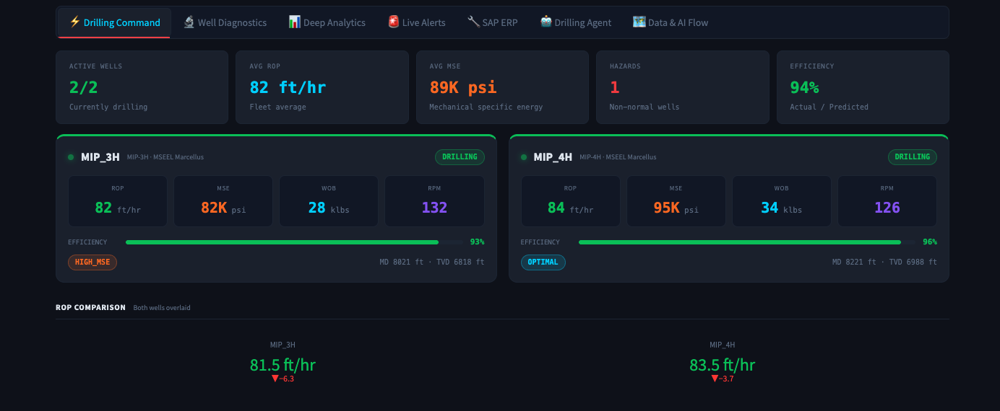
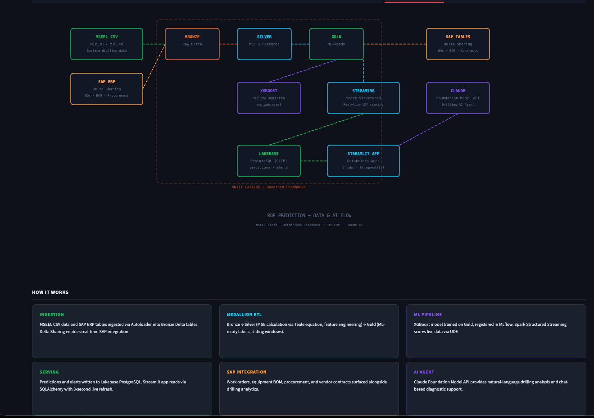
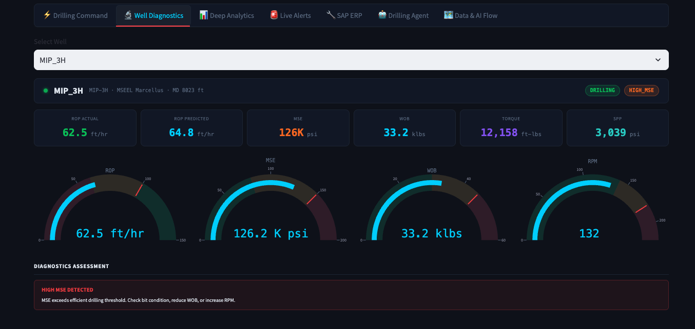
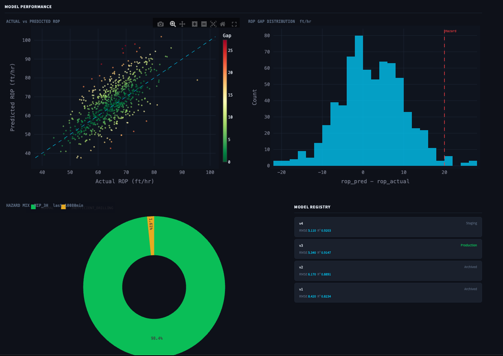

[](https://databricks.com)
[](https://docs.databricks.com/en/data-governance/unity-catalog/index.html)
[](https://docs.databricks.com/en/compute/serverless.html)

# ROP Prediction — Real-Time Drilling Optimization

A real-time Rate of Penetration (ROP) prediction and drilling optimization platform built as a [Databricks App](https://docs.databricks.com/en/dev-tools/databricks-apps/index.html). This solution accelerator demonstrates an end-to-end ML pipeline — from MSEEL field data ingestion through feature engineering, XGBoost model training, Spark Structured Streaming inference, and an operational Streamlit dashboard — for upstream oil & gas drilling operations.



## Overview

Rate of Penetration is the single most impactful metric in drilling economics. A 10% ROP improvement can save $500K+ per well in day-rate costs. This accelerator uses real [MSEEL (Marcellus Shale Energy and Environment Laboratory)](https://mseel.org/) drilling data to deliver:

- **Drilling Command** — Real-time fleet overview with ROP, MSE, WOB, RPM, and drilling efficiency across all active wells with hazard detection
- **Well Diagnostics** — Per-well sensor gauges, live trend charts, and automated diagnostics assessment (high MSE, stuck pipe risk, inefficient drilling)
- **Deep Analytics** — Actual vs predicted ROP scatter plots, ROP gap distribution, hazard breakdown, and MLflow model registry with version tracking
- **Live Alerts** — Streaming hazard feed with severity-based filtering and alert history
- **SAP ERP Integration** — Work orders, equipment BOM, procurement tracking, and vendor contracts
- **Drilling Agent** — Foundation Model API-powered AI assistant for natural-language drilling analysis and diagnostic support
- **Data & AI Flow** — Interactive architecture diagram showing the medallion pipeline from MSEEL CSV ingestion through Bronze/Silver/Gold to ML serving

## Architecture



## Dashboard Tabs



| Tab | Description |
|-----|-------------|
| **Drilling Command** | Fleet-level KPIs (active wells, avg ROP, avg MSE, hazards, efficiency), per-well status cards, ROP comparison chart |
| **Well Diagnostics** | Per-well deep dive with ROP actual/predicted, MSE, WOB, torque, SPP gauges, live trend, diagnostics assessment |
| **Deep Analytics** | Actual vs predicted scatter, ROP gap distribution, hazard mix donut, MLflow model registry (v1–v4 with RMSE/R²) |
| **Live Alerts** | Real-time hazard stream with HIGH_MSE, STUCK_PIPE_RISK, INEFFICIENT_DRILLING, ROP_GAP alerts |
| **SAP ERP** | Work orders, PM schedule, equipment master, maintenance history |
| **Drilling Agent** | Claude-powered chat for drilling parameter queries and optimization recommendations |
| **Data & AI Flow** | Interactive medallion pipeline diagram with "How It Works" cards |



## Wells & Data Source

This accelerator uses real drilling data from the [MSEEL project](https://mseel.org/) — a DOE-funded field laboratory in the Marcellus Shale of West Virginia:

| Well | Name | Field | Base Depth | Base ROP |
|------|------|-------|-----------|----------|
| MIP_3H | MIP-3H | MSEEL Marcellus | 8,000 ft | 75 ft/hr |
| MIP_4H | MIP-4H | MSEEL Marcellus | 8,200 ft | 68 ft/hr |

## Drilling Parameters

| Parameter | Unit | Description |
|-----------|------|-------------|
| ROP (actual) | ft/hr | Measured rate of penetration |
| ROP (predicted) | ft/hr | XGBoost model prediction |
| ROP Gap | ft/hr | Predicted - Actual (optimization opportunity) |
| MSE | psi | Mechanical Specific Energy (drilling efficiency) |
| WOB | klbs | Weight on Bit |
| RPM | rev/min | Rotary speed |
| Torque | ft-lbs | Surface torque |
| SPP | psi | Standpipe pressure |
| Flow Rate | gpm | Mud flow rate |
| Hookload | klbs | Surface hookload |

## Simulated Event Cycle

The simulator runs a 30-tick cycle to demonstrate real-time hazard detection:

| Ticks | Event | Affected Well |
|-------|-------|---------------|
| 0–7 | Normal drilling, good ROP | MIP_3H |
| 8–12 | High MSE event (bit wear) | MIP_3H |
| 13–17 | Stuck pipe risk (low ROP, high torque) | MIP_4H |
| 18–22 | Normal drilling | Both wells |
| 23–27 | Inefficient drilling (high ROP gap) | MIP_3H |
| 28–29 | Recovery / transition | Both wells |

## ML Pipeline

| Pipeline | Description |
|----------|-------------|
| `01_ingest_mseel_to_bronze.py` | Ingest MSEEL CSV drilling files → `drilling_demo_bronze.mseel_drilling_raw` |
| `02_bronze_to_silver_features.py` | Compute MSE (Teale equation), rolling stats, feature engineering → Silver |
| `03_train_rop_models.py` | XGBoost ROP predictor with MLflow tracking, model registry (v1–v4) |
| `04_streaming_scoring_and_alerts.py` | Spark Structured Streaming: real-time UDF scoring, hazard detection, Lakebase writes |
| `05_mseel_replay_producer.py` | Replay producer for continuous demo streaming |

## Infrastructure

| Script | Description |
|--------|-------------|
| `infra/01_create_lakehouse_tables.sql` | Unity Catalog setup — Delta tables for Bronze/Silver/Gold |
| `infra/02_create_lakebase_schema.sql` | Lakebase PostgreSQL schema — predictions, alerts, wells |
| `infra/populate_lakebase.py` | Seed script for initial Lakebase data |

## Getting Started

### Prerequisites

- A Databricks workspace with [Databricks Apps](https://docs.databricks.com/en/dev-tools/databricks-apps/index.html), [Lakebase](https://docs.databricks.com/en/lakebase/index.html), and a SQL Warehouse
- Databricks CLI installed and configured
- Unity Catalog enabled
- MSEEL drilling data mounted or uploaded to volumes

### Deploy with Databricks Asset Bundles (recommended)

```bash
databricks bundle deploy -t dev
databricks bundle run -t dev
```

### Deploy manually

1. Update `app.yaml` with your Lakebase instance name if different.

2. Import the app into your workspace:
   ```bash
   databricks workspace import-dir ./app /Workspace/Users/<your-email>/rop-prediction/app --overwrite
   databricks workspace import-file ./app.yaml /Workspace/Users/<your-email>/rop-prediction/app.yaml --overwrite
   ```

3. Create and deploy:
   ```bash
   databricks apps create rop-prediction --description "Real-Time ROP Prediction & Drilling Optimization"
   databricks apps deploy rop-prediction --source-code-path /Workspace/Users/<your-email>/rop-prediction
   ```

### Set Up the ML Pipeline

1. Run the infrastructure SQL scripts (`infra/01_*`, `infra/02_*`) on a SQL Warehouse.
2. Import pipelines to your workspace and run in order (01 → 05).
3. Start the replay producer job (`jobs/replay_producer_job.json`) for continuous streaming.

## Project Support

Please note the code in this project is provided for your exploration only, and is not formally supported by Databricks with Service Level Agreements (SLAs). It is provided AS-IS and we do not make any guarantees of any kind. Please do not submit a support ticket relating to any issues arising from the use of this project.

Any issues discovered through the use of this project should be filed as GitHub Issues on this repository. They will be reviewed on a best-effort basis but no formal SLA or support is guaranteed.


## License

**Definitions.**

**Agreement:** The agreement between Databricks, Inc., and you governing the use of the Databricks Services, as that term is defined in the Master Cloud Services Agreement (MCSA) located at www.databricks.com/legal/mcsa.

**Licensed Materials:** The source code, object code, data, and/or other works to which this license applies.

**Scope of Use.** You may not use the Licensed Materials except in connection with your use of the Databricks Services pursuant to the Agreement. Your use of the Licensed Materials must comply at all times with any restrictions applicable to the Databricks Services, generally, and must be used in accordance with any applicable documentation. You may view, use, copy, modify, publish, and/or distribute the Licensed Materials solely for the purposes of using the Licensed Materials within or connecting to the Databricks Services. If you do not agree to these terms, you may not view, use, copy, modify, publish, and/or distribute the Licensed Materials.

**Redistribution.** You may redistribute and sublicense the Licensed Materials so long as all use is in compliance with these terms. In addition:

- You must give any other recipients a copy of this License;
- You must cause any modified files to carry prominent notices stating that you changed the files;
- You must retain, in any derivative works that you distribute, all copyright, patent, trademark, and attribution notices, excluding those notices that do not pertain to any part of the derivative works; and
- If a "NOTICE" text file is provided as part of its distribution, then any derivative works that you distribute must include a readable copy of the attribution notices contained within such NOTICE file, excluding those notices that do not pertain to any part of the derivative works.

You may add your own copyright statement to your modifications and may provide additional license terms and conditions for use, reproduction, or distribution of your modifications, or for any such derivative works as a whole, provided your use, reproduction, and distribution of the Licensed Materials otherwise complies with the conditions stated in this License.

**Termination.** This license terminates automatically upon your breach of these terms or upon the termination of your Agreement. Additionally, Databricks may terminate this license at any time on notice. Upon termination, you must permanently delete the Licensed Materials and all copies thereof.

**DISCLAIMER; LIMITATION OF LIABILITY.**

THE LICENSED MATERIALS ARE PROVIDED "AS-IS" AND WITH ALL FAULTS. DATABRICKS, ON BEHALF OF ITSELF AND ITS LICENSORS, SPECIFICALLY DISCLAIMS ALL WARRANTIES RELATING TO THE LICENSED MATERIALS, EXPRESS AND IMPLIED, INCLUDING, WITHOUT LIMITATION, IMPLIED WARRANTIES, CONDITIONS AND OTHER TERMS OF MERCHANTABILITY, SATISFACTORY QUALITY OR FITNESS FOR A PARTICULAR PURPOSE, AND NON-INFRINGEMENT. DATABRICKS AND ITS LICENSORS TOTAL AGGREGATE LIABILITY RELATING TO OR ARISING OUT OF YOUR USE OF OR DATABRICKS' PROVISIONING OF THE LICENSED MATERIALS SHALL BE LIMITED TO ONE THOUSAND ($1,000) DOLLARS. IN NO EVENT SHALL THE AUTHORS OR COPYRIGHT HOLDERS BE LIABLE FOR ANY CLAIM, DAMAGES OR OTHER LIABILITY, WHETHER IN AN ACTION OF CONTRACT, TORT OR OTHERWISE, ARISING FROM, OUT OF OR IN CONNECTION WITH THE LICENSED MATERIALS OR THE USE OR OTHER DEALINGS IN THE LICENSED MATERIALS.
