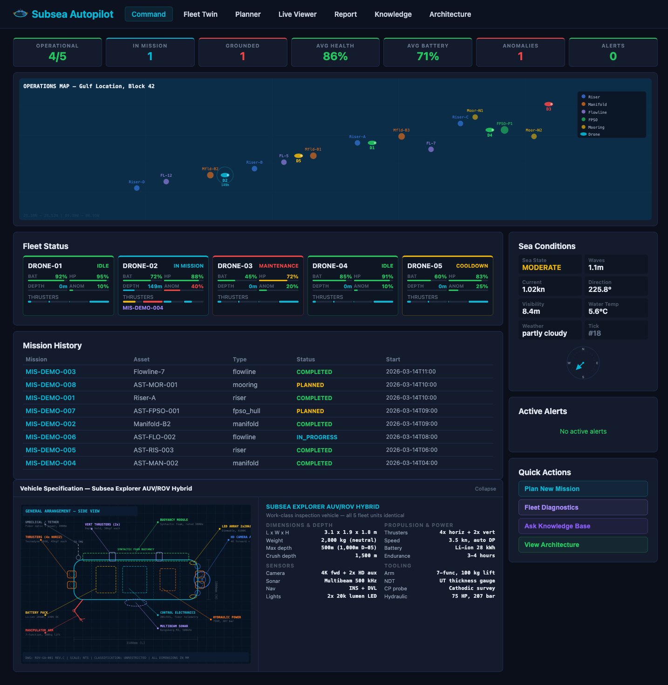
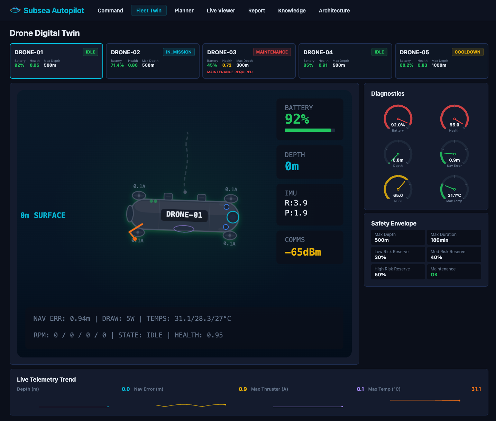
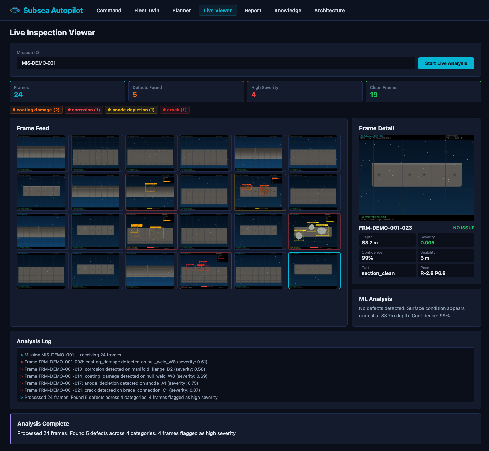
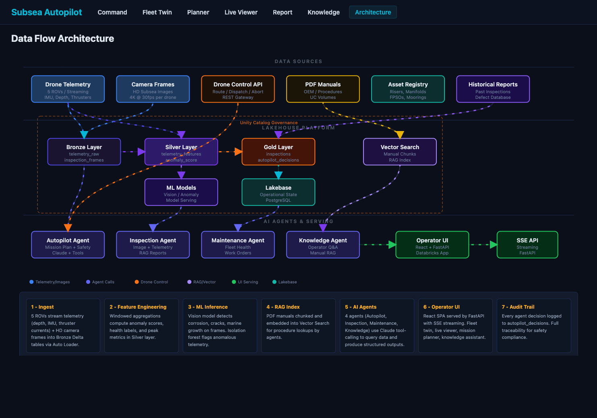

[](https://databricks.com)
[](https://docs.databricks.com/en/data-governance/unity-catalog/index.html)
[](https://docs.databricks.com/en/compute/serverless.html)

# Subsea Drone Autopilot

An autonomous subsea inspection platform built as a [Databricks App](https://docs.databricks.com/en/dev-tools/databricks-apps/index.html). This solution accelerator demonstrates an end-to-end AI-powered system for controlling a fleet of 5 underwater ROV/AUV drones — from mission planning and real-time computer vision inspection through AI-powered defect analysis and maintenance recommendations — for subsea oil & gas infrastructure integrity management.



## Overview

Subsea infrastructure inspection is critical for offshore oil & gas operations. Manual ROV inspections are expensive ($50K-$200K per campaign), time-consuming, and subject to human error. This accelerator delivers:

- **Fleet Command Dashboard** — Real-time operational picture of 5 subsea drones with KPIs, ocean operations map, mission history, sea conditions, active alerts, and vehicle specification blueprint
- **Drone Digital Twin** — Animated SVG visualization of each ROV with live telemetry, diagnostic gauges, safety envelopes, and sparkline trends



- **Mission Planner** — AI-powered mission planning with Claude Sonnet 4.6 via Databricks Model Serving. The Autopilot Agent enforces safety rules (battery reserves, depth margins, duration limits) and selects the optimal drone
- **Live Inspection Viewer** — Real-time frame-by-frame streaming of 24 computer vision-annotated underwater images with YOLOv8-style bounding boxes, defect classification, and severity scoring



- **Inspection Report** — Mission analytics dashboard with defect cards, severity metrics, evidence frames, manual references, and prioritized recommended actions
- **Knowledge Assistant** — Claude-powered Q&A agent with tool-calling against fleet data, inspection history, and RAG over subsea manuals
- **Architecture Diagram** — Interactive SVG data flow showing the complete medallion pipeline from telemetry ingestion through ML inference to AI agents

## Architecture



### Technology Stack

| Layer | Technology |
|-------|-----------|
| **Frontend** | React + TypeScript + Vite |
| **Backend** | FastAPI + uvicorn |
| **Streaming** | Server-Sent Events (SSE) via sse-starlette |
| **AI Agents** | Claude Sonnet 4.6 via Databricks Model Serving (function-calling) |
| **Data** | Delta Lake on Unity Catalog (10 tables) |
| **Operational DB** | Lakebase (PostgreSQL) for alerts + mission state |
| **RAG** | Vector Search with managed embeddings |
| **ML** | YOLOv8-style defect detection (simulated), anomaly scoring |
| **Simulator** | Physics-based telemetry with per-drone fault profiles |
| **Deployment** | Databricks App with Serverless compute |

## Fleet

| Drone | Model | Max Depth | Max Duration | State |
|-------|-------|-----------|-------------|-------|
| DRONE-01 | Subsea Explorer 500 | 500m | 3 hours | Idle |
| DRONE-02 | Subsea Explorer 500 | 500m | 3 hours | In Mission |
| DRONE-03 | Subsea Explorer 300 | 300m | 2 hours | Maintenance |
| DRONE-04 | Subsea Explorer 500 | 500m | 3 hours | Idle |
| DRONE-05 | Subsea Explorer 1000 | 1,000m | 4 hours | Cooldown |

## Subsea Assets

| Asset | Type | Depth | Integrity Class |
|-------|------|-------|----------------|
| Riser-A through D | Riser | 80–200m | A/B |
| Manifold-B1 through B3 | Manifold | 150–300m | B/C |
| Flowline-5, 7, 12 | Flowline | Various | A/B |
| FPSO-Hull-P1 | FPSO Hull | Surface | A |
| Mooring-N1, N2 | Mooring | 50–150m | B |

## Defect Types

| Defect | CV Color | Severity Range | Example Action |
|--------|----------|---------------|----------------|
| Corrosion | Red/Orange | Medium–High | Recoating, repair clamp |
| Crack | Red | High | NDT follow-up, engineering assessment |
| Marine Growth | Green | Low–Medium | Routine cleaning |
| Coating Damage | Orange | Medium | Monitor, recoat at next opportunity |
| Anode Depletion | Yellow | Medium–High | Anode replacement |

## AI Agents

### 1. Autopilot Agent (Mission Planner)
Plans and dispatches inspection missions with safety enforcement. 6 tools: `list_drones`, `get_drone_limits`, `plan_route`, `dispatch_mission`, `get_telemetry_summary`, `abort_mission`.

### 2. Inspection Agent (Report Generator)
Analyzes camera frames, telemetry, and manuals to produce structured defect reports. 5 tools: `get_inspection_frames`, `run_image_inference`, `get_telemetry_summary`, `query_manuals`, `write_report`.

### 3. Maintenance Advisor Agent
Fleet health analysis with condition-based maintenance recommendations. 5 tools: `list_drones`, `get_drone_limits`, `get_telemetry_trends`, `get_mission_history`, `query_manuals`.

### 4. Knowledge Assistant Agent
Operator Q&A with RAG over subsea manuals, fleet status, and inspection history. 4 tools: `query_manuals`, `get_fleet_status`, `get_inspection_history`, `get_telemetry_data`.

## Dashboard Pages

| Page | Route | Description |
|------|-------|-------------|
| Fleet Command | `/` | KPIs, ocean map, fleet grid, mission history, sea conditions, vehicle spec |
| Fleet Twin | `/fleet` | ROV digital twin with live gauges, sparklines, safety envelope |
| Mission Planner | `/planner` | Mission form with Autopilot Agent streaming |
| Live Viewer | `/live` | Real-time CV frame streaming with defect annotations |
| Inspection Report | `/inspection` | Mission picker with analytics, defect cards, recommended actions |
| Knowledge | `/knowledge` | Claude-powered Q&A with source citations |
| Architecture | `/dataflow` | Interactive SVG data flow diagram |

## Delta Tables

| Table | Purpose |
|-------|---------|
| `drone_status` | Live state of 5 drones |
| `drone_limits` | Safety envelopes per drone |
| `telemetry_raw` | Per-second sensor data |
| `telemetry_features` | Windowed anomaly scores |
| `inspections` | Mission records |
| `inspection_frames` | Camera frames with ML outputs |
| `autopilot_decisions` | Agent audit trail |
| `assets` | 15 subsea infrastructure assets |
| `alerts` | Operational alerts |
| `environment_conditions` | Sea state readings |

## Getting Started

### Prerequisites

- Databricks workspace with serverless compute
- SQL Warehouse
- Unity Catalog with a catalog and schema
- Databricks CLI v0.285+

### Deployment

```bash
# 1. Clone and navigate
git clone https://github.com/databricks-industry-solutions/energy-sandbox.git
cd energy-sandbox/subsea-drone-autopilot

# 2. Run DDL to create tables
# Execute ddl/create_tables.sql on your SQL warehouse

# 3. Build frontend
cd app/frontend && npm install && npm run build && cd ../..

# 4. Create deploy package
rm -rf _deploy && mkdir -p _deploy/agents _deploy/static/assets _deploy/static/frames
cp app/main.py app/config.py app/db.py app/simulator.py app/llm_client.py app/requirements.txt _deploy/
cp app/agents/*.py _deploy/agents/
cp app/static/index.html _deploy/static/
cp app/static/assets/* _deploy/static/assets/
cp frames/*.jpg _deploy/static/frames/

# 5. Upload and deploy
databricks workspace import-dir _deploy /Workspace/Users/<your-email>/subsea-drone-autopilot --overwrite --profile=<profile>
databricks apps deploy subsea-drone-autopilot --source-code-path /Workspace/Users/<your-email>/subsea-drone-autopilot --profile=<profile>
```

### Required Permissions

Grant the app's service principal access to your catalog:

```sql
GRANT USE CATALOG ON CATALOG <your_catalog> TO `<app-service-principal-client-id>`;
GRANT USE SCHEMA ON SCHEMA <your_catalog>.<your_schema> TO `<app-service-principal-client-id>`;
GRANT SELECT, MODIFY ON SCHEMA <your_catalog>.<your_schema> TO `<app-service-principal-client-id>`;
```

### Configuration

Update `app.yaml` with your warehouse ID and model endpoint:

```yaml
env:
  - name: DATABRICKS_WAREHOUSE_ID
    value: "<your-warehouse-id>"
  - name: CLAUDE_MODEL
    value: "databricks-claude-sonnet-4-6"

resources:
  - name: subsea-llm
    serving_endpoint: databricks-claude-sonnet-4-6
    permission: CAN_QUERY
```

## Data Sources

All data in this accelerator is **100% synthetic** — no external datasets are used:

- **CV Inspection Frames** — 24 images generated with Python Pillow (YOLOv8-style annotations)
- **Telemetry** — Physics-based simulator with sinusoidal oscillation and fault injection
- **Delta Table Seeds** — Fictional but realistic subsea infrastructure data
- **ROV Specs** — Generic "Subsea Explorer" (not based on any specific OEM product)
- **Asset Locations** — Fictional coordinates in a generic gulf location

## Project Structure

```
subsea-drone-autopilot/
├── app.yaml                    # Databricks App manifest
├── databricks.yml              # Bundle config
├── app/
│   ├── main.py                 # FastAPI backend (15 endpoints)
│   ├── config.py               # Environment configuration
│   ├── db.py                   # Delta SQL + Lakebase helpers
│   ├── simulator.py            # Physics-based fleet simulator
│   ├── llm_client.py           # Claude agent loop runner
│   ├── requirements.txt
│   ├── agents/
│   │   ├── subsea_autopilot_agent.py
│   │   ├── subsea_inspection_agent.py
│   │   ├── maintenance_advisor_agent.py
│   │   └── knowledge_agent.py
│   └── frontend/
│       ├── package.json
│       ├── vite.config.ts
│       └── src/
│           ├── main.tsx
│           └── pages/ (7 pages)
├── frames/                     # 24 CV-annotated inspection images
├── notebooks/
│   └── rag_setup.py            # Vector Search RAG pipeline
└── ddl/
    └── create_tables.sql       # Delta table DDL + seed data
```

## License

See [LICENSE](LICENSE).

## Contributing

See [CONTRIBUTING.md](CONTRIBUTING.md).

## Security

See [SECURITY.md](SECURITY.md).
